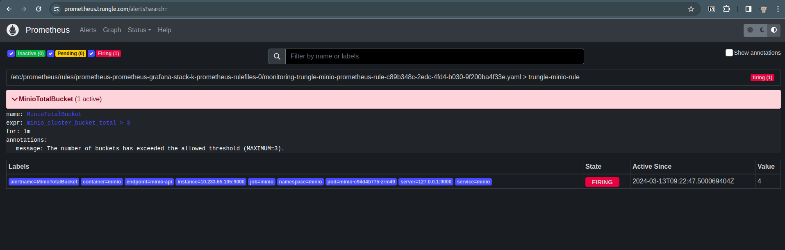
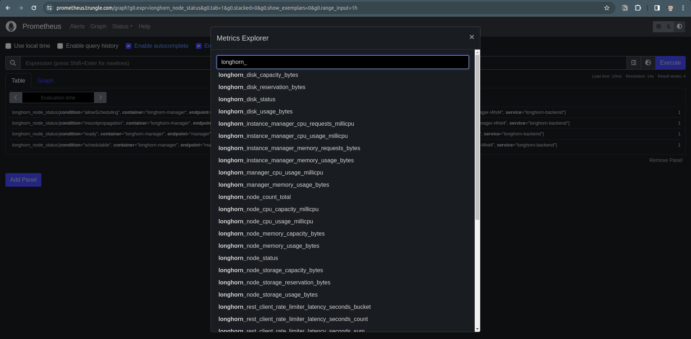
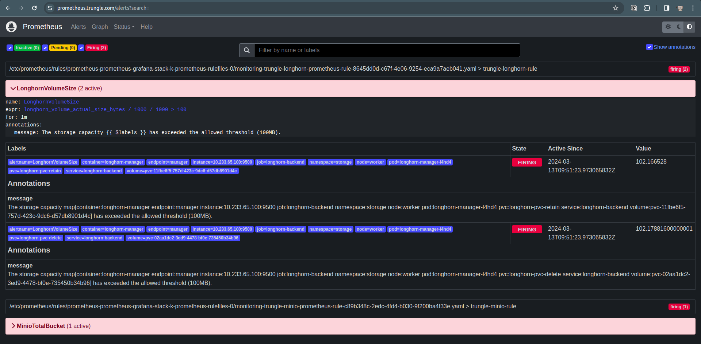
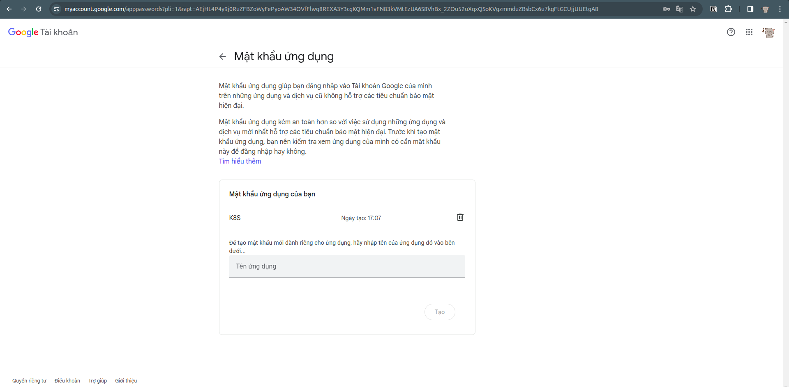
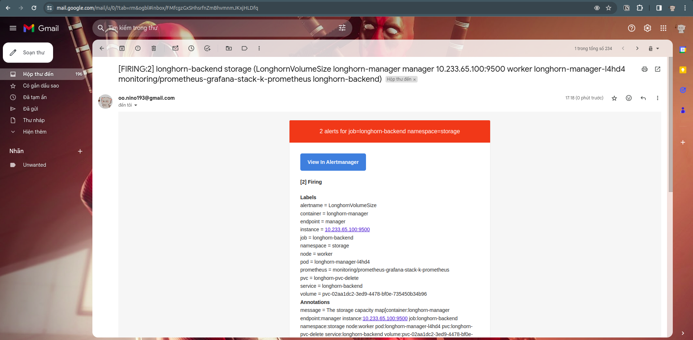

# I. Giới thiệu

Ở lesson trước, chúng ta đã tìm hiểu về các expose metrics của services để giám sát trên Prometheus. Sau đó, thử cấu hình cảnh báo với **additionalPrometheusRules** trong file values-prometheus.yaml. Tuy nhiên mỗi lần thêm cảnh báo mới phải update lại Prometheus bằng file yaml thì rất bất tiện và thiếu linh hoạt.

Do đó, ở lesson này chúng ta sẽ tìm hiểu cách thiết lập cảnh báo theo cách linh hoạt hơn bằng Prometheus Rule. Ý tưởng bao gồm 2 phần:

1. Cấu hình Rule Selector ở Prometheus để lựa chọn PrometheusRule được tạo ở các service.
2. Tạo PrometheusRule ở các service bạn muốn tạo cảnh báo trên Prometheus.


# II. Thực hành

## 1. Cấu hình PrometheusRule

### Cấu hình ruleSelector cho Prometheus

Update đoạn code sau trong file **values-prometheus.yaml**:

```yaml
    ruleSelector:
        matchExpressions:
        - key: app
            operator: In
            values:
            - prometheus-grafana-stack
            - prometheus-rule
```

Update lại stack bằng lệnh helm:
```shell
helm -n monitoring upgrade --install prometheus-grafana-stack -f values-prometheus.yaml prometheus-community/kube-prometheus-stack
```

### Tạo PrometheusRule cho service

Bây giờ muốn tạo alert cho service không cần đụng chạm đến file values-prometheus.yaml. Chúng ta sẽ tạo file alert riêng cho service, ví dụ với Minio, tạo file **rule-minio.yaml** với nội dung như sau:

```yaml
apiVersion: monitoring.coreos.com/v1
kind: PrometheusRule
metadata:
  labels:
    app: prometheus-rule #Label này match với cấu hình ruleSelector để nó được load tự động vào Prometheus
    role: alert-rules
  namespace: monitoring
  name: trungle-minio-prometheus-rule #Đây là tên hiển thị trong danh sách PrometheusRule trên K8S
spec:
  groups:
  - name: "trungle-minio-rule" #Tên Rule hiển thị trên mục Rule của Prometheus trên web Prometheus
    rules:
    - alert: MinioTotalBucket #Tên của cảnh báo
      for: 1m #Thời gian đạt điều kiện trước khi sinh cảnh báo. 
      expr: minio_cluster_bucket_total > 3 #Điểu kiện so sánh để sinh cảnh báo
      annotations:
        message: The number of buckets has exceeded the allowed threshold (MAXIMUM=3).
```

Apply rule bằng lệnh:
```shell
kubectl apply -f rule-minio.yaml
```

Kiểm tra rule đã được tạo chưa:
```shell
kubectl -n monitoring get PrometheusRule
```

Giờ thì thêm bucket vào minio, sau đó kiểm tra xem đã có cảnh báo trên UI chưa.
<p align="center"></p>

Tiếp tục thử với service Longhorn đã expose metrics ở lesson 9. Trước tiên, kiểm tra xem Longhorn đang support những metric nào bằng cách search trên UI:
<p align="center"></p>

Tạo file **rule-longhorn.yaml** và apply tương tự như Minio:
```yaml
apiVersion: monitoring.coreos.com/v1
kind: PrometheusRule
metadata:
  labels:
    app: prometheus-rule #Label này match với cấu hình ruleSelector để nó được load tự động vào Prometheus
    role: alert-rules
  namespace: monitoring
  name: trungle-longhorn-prometheus-rule #Đây là tên hiển thị trong danh sách PrometheusRule trên K8S
spec:
  groups:
  - name: "trungle-longhorn-rule" #Tên Rule hiển thị trên mục Rule của Prometheus trên web Prometheus
    rules:
    - alert: LonghornVolumeSize #Tên của cảnh báo
      for: 1m #Thời gian đạt điều kiện trước khi sinh cảnh báo. 
      expr: longhorn_volume_actual_size_bytes/1000/1000 > 100 #Điểu kiện so sánh để sinh cảnh báo
      annotations:
        message: The storage capacity {{ $labels }} has exceeded the allowed threshold (100MB).
```

Chờ một chút để Prometheus update và xem kết quả:
<p align="center"></p>

## 2. Cấu hình Alert Manager gửi cảnh báo qua Gmail

### Tạo mật khẩu ứng dụng trong tài khoản Google

Đầu tiên truy cập vào trang tài khoản https://myaccount.google.com/ để bật xác thực 2 lớp. Sau đó tạo 1 mật khẩu ứng dụng, copy mật khẩu lại rồi tiến hành bước tiếp theo.
<p align="center"></p>


### Cấu hình Alert Manager

Chỉnh sửa file **values-prometheus.yaml** như sau:
```yaml
alertmanager:
  enabled: true
  config:
      group_by: ['namespace', 'job']
      group_wait: 5s
      group_interval: 5s
      repeat_interval: 12h
      receiver: 'gmail'
      routes:
      - receiver: 'gmail'
        group_wait: 10s
        matchers:
          - alertname = "monitoring"
    receivers:
    - name: 'gmail'
      email_configs:
      - to: oo.nino193@gmail.com
        from: oo.nino193@gmail.com
        smarthost: smtp.gmail.com:587
        auth_username: 'oo.nino193@gmail.com'
        auth_identity: 'oo.nino193@gmail.com'
        auth_password: 'ssez cmat wgxl irls' #App password
```

Apply lại stack và kiểm tra mail xem có nhận được alert chưa nhé!
```cmd
helm -n monitoring upgrade --install prometheus-grafana-stack -f values-prometheus.yaml prometheus-community/kube-prometheus-stack
```
<p align="center"></p>

Tuyệt, vậy là chúng ta đã hoàn thành phần thực hành ở lesson này.