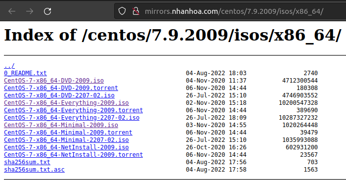
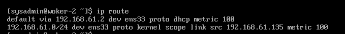
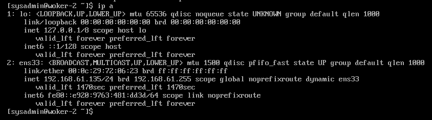
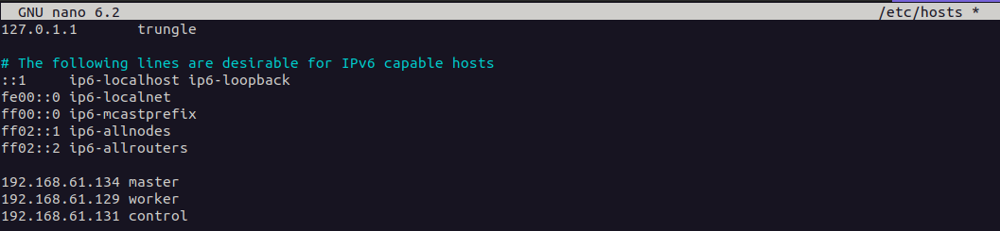
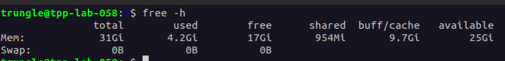
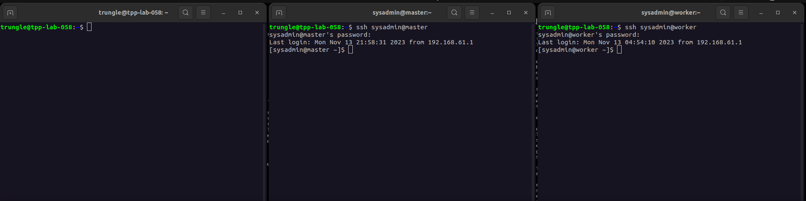
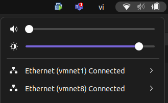

# I. Cài đặt VMWare Workstation trên Ubuntu

Để xây dựng hệ thống K8S ở local chúng ta cần nhiều máy tính để kết nối chúng với nhau. Tuy nhiên, thực hành trên máy cá nhân thì chúng ta sẽ tạo ra các máy ảo xem chúng như các máy local để giả lập.

Làm theo hướng dẫn sau: https://topdev.vn/blog/huong-dan-cach-cai-dat-vmware-workstation-tren-ubuntu/

>Bonus: bạn có thể tìm key free để mở khoá bản trial trên internet. Chẳng hạn ***[ở đây!](https://gist.github.com/PurpleVibe32/30a802c3c8ec902e1487024cdea26251)***


# II. Tạo máy ảo trên VMWare
## 1. Download Centos

Link download: https://www.centos.org/download/ (kiểm tra kiến trúc của máy local để chọn phiên bản cho phù hợp. Có thể dùng lệnh 'uname -a' ở terminal để xem thông tin).

Ví dụ kết quả khi chạy trên terminal như sau: <br>
<code>Linux tpp-lab-058 6.2.0-34-generic #34~22.04.1-Ubuntu SMP PREEMPT_DYNAMIC Thu Sep  7 13:12:03 UTC 2 x86_64 x86_64 x86_64 GNU/Linux</code>
<br>
Có nghĩa là máy tính của tôi đang chạy OS trên kiến trúc x86_64, tôi sẽ download Centos kiến  trúc này.

Sử dụng Centos vì đây là OS open source có tỉ lệ tương thích cao với các software khi setup K8S. Có 2 loại Centos có thể lựa chọn để tạo máy ảo:
- Có giao diện GUI: Dung lượng cài đặt sẽ cao hơn vì phải cài đặt các phần mềm đồ hoạ, giao diện nhưng dễ sử dụng và tương tác.
- Không có GUI (minimal): Dung lượng cài đặt nhỏ nhưng thao tác 100% trên terminal.

Khuyến nghị sử dụng gói không có GUI, vì nó nhẹ và chúng ta bắt buộc sử dụng hoàn toàn 100% trên terminal nên không cần GUI.

<p align="center">
  
</p>


## 2. Tạo máy ảo

Làm theo hướng dẫn sau: https://readlearncode.com/centos/how-to-create-a-centos-7-virtual-machine-in-vmware-workstation-15/

>Một số lưu ý khi tạo máy ảo:
>- Tuỳ thuộc vào tài nguyên ROM, RAM, CPU của máy local mà lựa chọn chia sẻ dung lượng cho máy ảo nhằm tránh bị tràn dung lượng, khi khởi động lại máy local sẽ không lên.
>- Khuyên nghị tối thiểu cho 1 máy ảo là 20GB ROM (disk), 1GB RAM, 1 CPU (Processor) trong trường hợp tạo thực hành tìm hiểu hệ thống.
>- Bước gắn thêm disk cho máy ảo chỉ là optional nếu muốn có thêm phân vùng lưu trữ dữ liệu.

>Một số lưu ý với trường hợp tạo máy ảo setup K8S:
>- Dung lượng tối thiểu cho 1 máy ảo: 20GB disk, 2GB RAM, 2 CPU (Vì khi chạy các phần mềm trong K8S sẽ gặp lỗi do thiếu tài nguyên).
>- Tạo user với quyền adminstrator user_name:sysadmin/password:sysadmin cho tất cả máy ảo.
>- Bật connect internet NAT để máy ảo có thể kết nối ra internet cài phầm mềm.


## 3. Setup máy ảo chuẩn bị cho K8S

Vì thực hiện trên máy local nên tài nguyên có hạn, do đó tôi sẽ hạn chế số lượng node chỉ gồm:
- 1 node master
- 1 node worker
- 1 node control (optional): nếu bạn muốn có 1 máy riêng biệt để chạy quản lý k8s và cài các phần mềm liên quan không ảnh hưởng đến máy cá nhân. Tôi sẽ hướng dẫn cài đặt cả máy control nhưng khi thực hành tôi sẽ dùng trực tiếp máy local làm node control (tài nguyên có hạn).

>***Lưu ý: thực hiện cấu hình cho toàn bộ máy ảo như bên dưới***


### Tạo SSH key và cấu hình kết nối SSH

Sau khi tạo xong 3 máy ảo và start chúng lên thì chúng ta sẽ thao tác trên các máy ảo thông qua kết nối remote ssh từ máy local. Vì cài Centos minimal nên thao tác trực tiếp sẽ không dùng được copy/paste (trong terminal dùng ctrl + shift + C/V) và việc swtich tab (alt + tab) qua lại giữa VMWare và các tab khác sẽ hay bị keep phím alt. Do đó, sử dụng terminal trên máy local thao tác sẽ tiện lợi hơn.

**[Ở các máy ảo]**

Trước tiên, ở các máy ảo, cần lấy địa chỉ IP kết nối internet của chúng như sau:

Kiểm tra xem IP route default của máy ảo:
><code>ip route</code>
<p align="center"></p>
Như ví dụ trên, máy ảo đang kết nối với IP 192.168.61.number_ip (ở đây 2 là IP của route trong mạng này).

Tiếp theo, tìm địa chỉ IP đang sử dụng kết nối internet của máy ảo có tiền tố '192.168.61'
><code>ip a</code>
<p align="center"></p>
Như vậy, 192.168.61.135 chính là IP cần lấy.

Sau khi lấy được tất cả IP của các máy ảo thì khai báo chúng vào file hosts trên máy local.
><code>sudo nano /etc/hosts</code>
<p align="center"></p>

Khai báo theo format IP/Hostname. Trong đó, hostname đặt cho các máy bạn muốn dùng làm master, worker, control.

**[Ở máy Local]**

Tạo ssh key nếu chưa có.
><code>ssh-keygen</code>

Copy ssh key của máy local vào các máy ảo. Vì đã setup hostname nên ta chỉ cần gọi hostname thay vì gọi IP của máy ảo:
><code>ssh-copy-id sysadmin@master<br>
ssh-copy-id sysadmin@worker<br>
ssh-copy-id sysadmin@control</code>

Xong, bây giờ thử ssh vào máy control theo format ***ssh user@hostname*** và nhập password của user.s
><code>ssh sysadmin@control</code>

**[SSH ở máy local vào control]**

Thực hiện tạo ssh và config file /etc/hosts như đã làm ở máy local. Vì máy control sẽ kết nối với master và worker để setup k8s, còn máy local chỉ kết nối để kiểm tra.

Flow như sau: local >>ssh>> control >>ssh>> master/worker.


### Tắt swap của hệ thống

**[SSH ở máy local vào các máy ảo]**

Swap trong Ubuntu (cũng như trong hầu hết các hệ điều hành Linux) là một phân vùng hoặc tệp ảo được sử dụng để mở rộng bộ nhớ RAM của máy tính. Swap được sử dụng để lưu trữ dữ liệu chưa cần thiết hoặc chưa sử dụng trong RAM để giải phóng bộ nhớ RAM cho các ứng dụng và quá trình khác. Điều này cho phép máy tính hoạt động trơn tru khi bộ nhớ RAM bị sử dụng hết hoặc khi cần thêm bộ nhớ tạm thời.

Swap có thể được cấu hình như một phân vùng trên ổ cứng hoặc là một tệp trên hệ thống tệp. Cấu hình swap phụ thuộc vào quyết định của người quản trị hệ thống và nhu cầu sử dụng. Một hệ thống có swap tốt có thể giúp tránh tình trạng gãy ứng dụng hoặc đóng máy tính khi bộ nhớ RAM bị quá tải.

Để kiểm tra tài nguyên swap có sẵn trên hệ thống Ubuntu của bạn, bạn có thể sử dụng lệnh <code>swapon -s</code>.

Dưới đây là một số hướng dẫn về khi nào nên và không nên sử dụng swap:
- Khi Nên Sử Dụng Swap:
  - Khi Bộ Nhớ RAM Bị Sử Dụng Hết: Swap rất hữu ích khi bộ nhớ RAM của hệ thống bị sử dụng hết. Trong trường hợp này, swap sẽ được sử dụng để lưu trữ dữ liệu không cần thiết để giải phóng bộ nhớ RAM cho các ứng dụng quan trọng.
  - Cho Hệ Thống Có Ít RAM: Trên các hệ thống có bộ nhớ RAM hạn chế, swap có thể là một giải pháp tốt để tăng sự sẵn sàng và tránh trường hợp gãy ứng dụng.
  - Cho Hệ Thống Servers: Trên các máy chủ, swap có thể hữu ích để đảm bảo tính ổn định của hệ thống trong trường hợp tải cao hoặc các ứng dụng gây sử dụng bộ nhớ lớn.
- Khi Không Nên Sử Dụng Swap:
  - Trên Hệ Thống Có Đủ RAM: Nếu hệ thống có đủ bộ nhớ RAM cho mọi tác vụ, sử dụng swap có thể làm chậm hiệu suất. Trong trường hợp này, bạn có thể tắt swap hoặc cấu hình nó để không sử dụng tự động.
  - Cho Hệ Thống Có Ổ Cứng SSD: Trên các hệ thống sử dụng ổ cứng SSD (Solid State Drive), việc sử dụng swap có thể gây mòn nhanh ổ đĩa SSD do việc ghi thường xuyên lên nó. Nếu bạn sử dụng SSD, hãy cân nhắc giảm kích thước swap hoặc tắt nó.
  - Trong Môi Trường Yêu Cầu Độ Ổn Định Cao: Trong môi trường yêu cầu độ ổn định cao và hiệu suất cao, như các máy chủ sản xuất và hệ thống thời gian thực, bạn có thể tắt swap hoặc cân nhắc sử dụng nó rất cẩn thận để tránh trễ hoặc sự cố không mong muốn.

Các bước thực hiện tắt swap:
- Tắt swap: <code>sudo swapoff -a</code>
- Mở file fstab: <code>sudo nano /etc/fstab</code> (nhập password 'sysadmin' nếu yêu cầu)
- (Option) Nếu lỗi 'not found nano': <code>sudo yum install nano</code> để cài đặt editor bằng nano
- Thêm '#' ở đầu dòng khai báo /swapfile trong file fstab
- Ctrl + X để tắt. Hiện muốn lưu thay đổi nhấn 'y'. Chọn đường dẫn lưu thì để mặc định, nhấn enter.

Kiểm tra swap đã tắt chưa: <code>free -h</code>
<p align="center">
  
</p>


### Cấu hình thông số hệ thống

**[SSH ở máy local vào các máy ảo]**

Disable SELinux

><code>sudo setenforce 0 </code><br>
<code>sudo sed -i --follow-symlinks 's/SELINUX=enforcing/SELINUX=disabled/g' /etc/sysconfig/selinux</code>

Tắt service firewallD

><code>sudo systemctl stop firewalld<br>
sudo systemctl disable firewalld</code>

Cấu hình ip_forward

><code>sudo sysctl -w net.ipv4.ip_forward=1</code>


### Restart tất cả máy ảo

**[SSH ở máy local vào các máy ảo]**

Sau khi setup xong tất cả các bước ở trên thì chúng ta tiến hành khởi động lại các máy ảo bằng lệnh <code>sudo reboot</code>

Kết nối ssh sẽ tự động ngắt kết nối, chờ máy ảo khởi động xong sẽ ssh vô lại bình thường.

Như vậy, chúng ta đã tạo và config xong các máy chuẩn bị cho việc tạo cụm K8S.
<p align="center">
  
</p>


# III. Tổng kết

Như vậy chúng ta đã hoàn thành việc thiết lập các máy tính để chuẩn bị cho việc setup K8S on-premise.

Các bước cần nắm:
- Tạo các máy ảo để làm master/worker/control
- Cấu hình ssh từ máy local vào máy control, từ máy control vào máy master/worker.
- Cấu hình hệ thống cho các máy ảo: tắt swap, tắt firewall, ip_v4.


# IV. Thông tin thêm

## 1. Shutdown tất cả máy ảo trước khi shutdown máy local

Nếu bạn không tắt hết ứng dụng đang chạy mà shudown ngang máy tính của bạn nó sẽ ảnh hưởng đến hệ thống vì bị termirate đột ngột. Khi bật máy tính lên lại có thể nó sẽ đứng màn hình không khởi động được máy.

## 2. Connect mạng ảo trước khi mở máy ảo

Khi mở máy tính lên thì mạng ảo của VMWare sẽ bị disconnect. Do đó, cần connect lại các mạng ảo để khi bật máy ảo network sẽ hoạt động bình thường.

<p align="center">
  
</p>

vmnet1 và vmnet8 là gì?

>vmnet1:
>- Mạng vmnet1 là mạng host-only tùy chỉnh. Bạn có thể tạo và cấu hình nhiều mạng host-only như vmnet1, vmnet2, và nhiều hơn nữa.
>- Mạng vmnet1 cung cấp một cách để các máy ảo trên cùng một máy chủ VMware giao tiếp với nhau bằng cách sử dụng mạng này.
>- Các máy ảo trong mạng vmnet1 không thể truy cập internet hoặc các mạng bên ngoài mà không cấu hình thêm.

>vmnet8:
>- Mạng vmnet8 là mạng NAT (Network Address Translation) mặc định được cấu hình trong VMware.
>- Mạng vmnet8 cho phép máy ảo kết nối tới internet thông qua kết nối NAT.
>- Mạng vmnet8 cho phép máy ảo truy cập internet và các mạng bên ngoài, nhưng máy tính chứa máy ảo sẽ là điểm cuối NAT.

## 3. Lỗi không thể install vmnet ở Linux

Vào một ngày đẹp trời, bạn mở Workstation lên để tiếp tục hành trình thám hiểm K8S thì nó bắt bạn install vmnet vì lý do nào đó mà vmnet đã bị xoá. Nhưng khi install nó lại báo fail, dưới đây là cách fix:
```shell
cd /usr/lib/vmware/modules/source
sudo git clone https://github.com/mkubecek/vmware-host-modules
cd vmware-host-modules
# Checkout theo version workstation đang cài trên máy
sudo git checkout workstation-17.0.2
sudo make
sudo tar -cf vmnet.tar vmnet-only
sudo tar -cf vmmon.tar vmmon-only
sudo mv vmnet.tar /usr/lib/vmware/modules/source/
sudo mv vmmon.tar /usr/lib/vmware/modules/source/
sudo vmware-modconfig --console --install-all
```