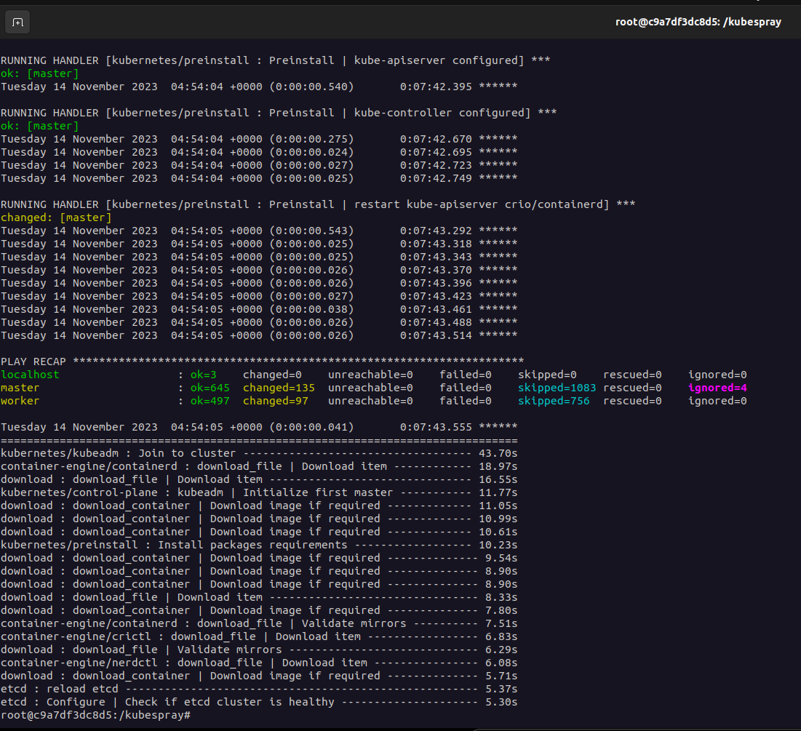
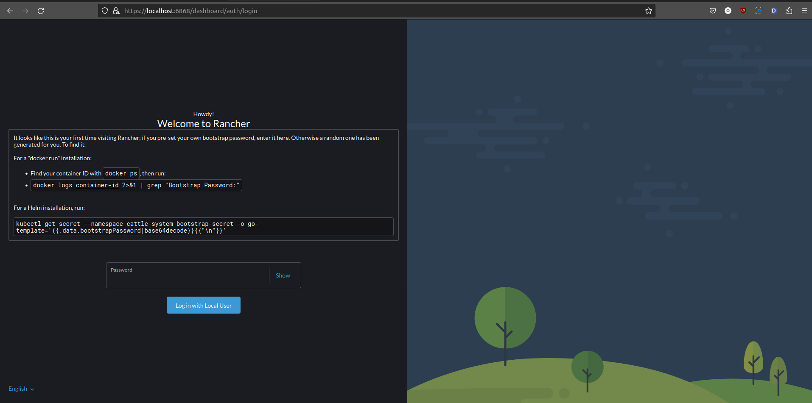
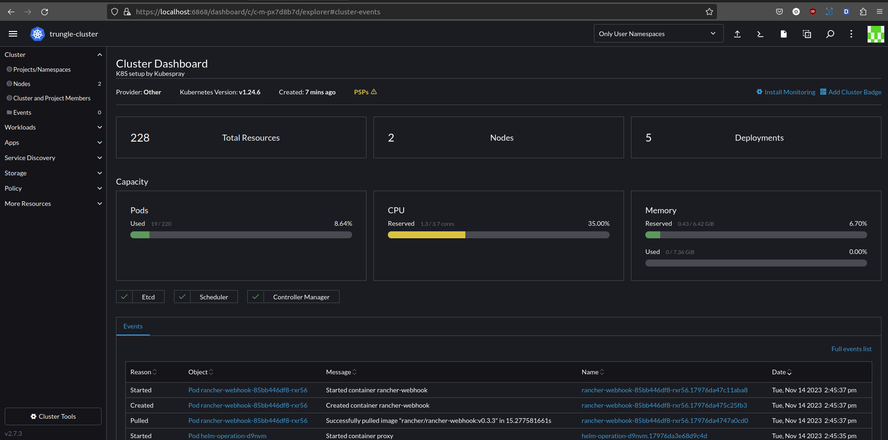

# I. Cài đặt cụm K8S bằng Kubespray
## 1. Kubespray là gì?

Kubespray là một dự án mã nguồn mở sử dụng Ansible để triển khai và quản lý cụm Kubernetes. Nó cung cấp một bộ các tập lệnh Ansible để tự động hóa quá trình triển khai Kubernetes trên một cụm máy chủ.

Điểm nổi bật của Kubespray:

    Triển khai Kubernetes: Kubespray sử dụng Ansible để thực hiện các nhiệm vụ cụ thể liên quan đến triển khai Kubernetes, bao gồm việc cài đặt và cấu hình các thành phần như etcd, kube-apiserver, kube-controller-manager, kube-scheduler, và các thành phần khác của Kubernetes.

    YAML Configuration: Kubespray sử dụng các tệp cấu hình YAML để mô tả trạng thái mong muốn của cụm Kubernetes. Các tệp cấu hình này được thực hiện thông qua Ansible, giúp đơn giản hóa quá trình triển khai và quản lý.

    Tích hợp với Ansible: Vì Kubespray sử dụng Ansible, người sử dụng có thể tận dụng sức mạnh và tính linh hoạt của Ansible để tùy chỉnh và mở rộng quá trình triển khai của họ.

Tóm lại, Ansible là công cụ tự động hóa, trong khi Kubespray là một dự án cụ thể sử dụng Ansible để tự động hóa việc triển khai và quản lý cụm Kubernetes. Ansible giúp tạo ra sự linh hoạt và mở rộng khi triển khai Kubernetes thông qua Kubespray.


## 2. Triển khai cụm K8S

Tại thời điểm tôi viết hướng dẫn này thì Kubespray đang có bản release mới nhất là v2.23.1 nhưng tôi sẽ sử dụng bản v2.20.0 để cài đặt K8S. Lý do là vì các phiên bản mới hơn hiện tại chứa các component confict version với nhau chưa được support (https://github.com/kubernetes-sigs/kubespray/tree/v2.22.0).

Trong github Kubespray có phần **Quick Start** hướng dẫn setup trên máy. Tuy nhiên, khuyến nghị không dùng cách này vì rất dễ xảy ra lỗi do xung đột version của ansuble, pip, python,... ở máy của bạn. Do đó, cách tốt hơn là dựng container đóng gói môi trường Kubespray tương ứng với version sử dụng để setup (100% thành công nếu không do nhân phẩm 😂).

Let's go!

[Thực hiện trên node control (tôi dùng máy local làm node control)]

### Tạo thư mục chứa toàn bộ source code K8S
><code>mkdir k8s_lab</code><br>
<code>cd k8s_lab</code>

### Clone Kubespray với version release v2.20.0
><code>git clone https://github.com/kubernetes-sigs/kubespray.git --branch release-2.20</code>

### Copy kubespray/inventory/sample ra để config
><code>cp -rf kubespray/inventory/sample trungle-cluster</code><br>
<code>cd trungle-cluster</code>

Lúc này trong folder **trungle-cluster** gồm 1 folder *group_vars* và file *inventory.ini*

### Tạo file config cụm host.yml
><code>touch host.yml</code><br>
<code>nano host.yml</code>

Paste nội dung config bên dưới vào file host.yml rồi lưu lại (Điền IP của node master, worker như đã setup ở bài 1 vào cho đúng nhé 😶).

    [all]
    master  ansible_host=192.168.61.128      ip=192.168.61.128
    worker  ansible_host=192.168.61.129      ip=192.168.61.129

    [kube-master]
    master

    [kube-node]
    worker

    [etcd]
    master

    [k8s-cluster:children]
    kube-node
    kube-master

    [calico-rr]

    [vault]
    master
    worker

Giải thích cấu trúc file host.yml miếng:
- [all]: Đây là một nhóm máy chủ chung, chứa thông tin về tất cả các máy chủ. Mỗi máy chủ được đặc tả với ansible_host là địa chỉ IP để Ansible biết nơi triển khai, và ip là địa chỉ IP của máy chủ.
- [kube-master]: Nhóm này chứa tên các máy chủ sẽ được sử dụng làm các nút master trong cụm Kubernetes. Trong trường hợp này, chỉ có máy chủ có tên là master.
- [kube-node]: Nhóm này chứa tên các máy chủ sẽ được sử dụng làm các nút worker (node) trong cụm Kubernetes. Trong trường hợp này, chỉ có máy chủ có tên là worker.
- [etcd]: Nhóm này chỉ ra máy chủ sẽ làm nhiệm vụ etcd, một phần quan trọng của hệ thống lưu trữ cụm Kubernetes. Trong trường hợp này, chỉ có máy chủ có tên là master.
- [k8s-cluster:children]: Đây là một nhóm chứa các nhóm con liên quan đến cụm Kubernetes. Ở đây, có kube-node và kube-master.
- [calico-rr]: Để trống, chúng ta không dùng loại network calico.
- [vault]: Nhóm này chỉ ra máy chủ sẽ chứa Vault, một công cụ quản lý secret và credential. Trong trường hợp này, có cả master và worker.

### Đổi CNI (Network plugin của K8S)
><code>nano group_vars/k8s_cluster/k8s-cluster.yml</code><br>
Đổi giá trị **kube_network_plugin: calico** thành **kube_network_plugin: plannel**.

Plannel sẽ ổn định hơn trong quá trình ansible setup K8S.

### Dựng container Kubespray
Tôi thực hiện trực tiếp trên máy local nên đã có Docker, nếu bạn thực hiện setup từ node control thì thực hiện cài đặc Docker như sau:
><code>sudo yum update</code><br>
><code>curl -fsSL https://get.docker.com/ | sh</code><br>
><code>sudo usermod -aG docker sysadmin</code>

>***[Error] Cannot connect to the Docker daemon at unix:///var/run/docker.sock. Is the docker daemon running?***<br>
Nếu gặp lỗi sau khi gọi lệnh của docker thì thực hiện các bước sau:<br> <code>sudo systemctl restart docker<br>sudo service docker restart</code>

Tạo docker-container rồi thực hiện cài đặt trên container này:
>Lưu ý: Trước khi tạo container cần thực hiện ssh từ node setup vào node master và worker để tránh bị lỗi ssh khi thực hiện setup trên container.

```shell
docker run --rm -it \
--mount type=bind,source=/home/trungle/learn-code/k8s/k8s_lab/trungle-cluster,dst=/inventory \
--mount type=bind,source=/home/trungle/.ssh/id_ed25519,dst=/root/.ssh/id_rsa \
--mount type=bind,source=/home/trungle/.ssh/id_ed25519,dst=/home/sysadmin/.ssh/id_rsa \
quay.io/kubespray/kubespray:v2.20.0 bash
```
Giải thích xíu về  lệnh *docker run* ở trên:

    --rm: Khi container kết thúc, nó sẽ tự động bị xóa khỏi hệ thống. Điều này giúp giữ cho hệ thống sạch sẽ và không giữ lại các container không cần thiết.

    -it: Kết hợp giữa hai option -i (interactive) và -t (tty), cho phép bạn tương tác với container thông qua một terminal.

    --mount type=bind,source=/home/trungle/learn-code/k8s/k8s_lab/trungle-cluster,dst=/inventory: Mount thư mục chứa các file config tạo cụm K8S vào container để sử dụng setup.

    --mount type=bind,source=/home/trungle/.ssh/id_ed25519,dst=/root/.ssh/id_rsa: Container có thể ssh vào các node master, worker.

    --mount type=bind,source=/home/trungle/.ssh/id_ed25519,dst=/home/sysadmin/.ssh/id_rsa: Tương tự như trên, gán quyền ssh cho user sysadmin.

    quay.io/kubespray/kubespray:v2.20.0 bash: Sử dụng images quay.io/kubespray/kubespray:v2.20.0 để tạo container và chạy một phiên bản của shell Bash.

### Chạy lệnh setup cụm K8S trong container
Khi run lệnh Docker ở trên bạn sẽ được tự động truy cập vào container. Ví dụ: *root@c9a7df3dc8d5:/kubespray#*

Tại đây, chạy lệnh setup:
><code>ansible-playbook -i /inventory/host.yml cluster.yml --user=sysadmin --ask-pass --become --ask-become-pass</code><br>
Khi terminal yêu cầu nhập pass ssh vào user sysadmin và root ở node master, worker thì nhập password đã setup máy ảo ở bài 1: **sysadmin**

Pha tách trà ngồi thưởng thức chờ nó setup xong thôi 🍵 hehe. Nếu kết quả như hình bên dưới (fail ở các node = 0) là đã thành công!
<p align="center"></p>

### Kiểm tra cụm trên node master
Giờ thì exit khỏi container được rồi, nó đã hoàn thành vai trò của mình.
Tiếp theo, thực hiện ssh vào node master để kiểm tra xem cụm K8S như thế nào.
><code>ssh sysadmin@master</code><br>
<code>mkdir -p $HOME/.kube</code><br>
<code>sudo cp /etc/kubernetes/admin.conf $HOME/.kube/config</code><br>
<code>sudo chown $(id -u):$(id -g) $HOME/.kube/config</code>

```shell
[sysadmin@master ~]$ kubectl get nodes
NAME     STATUS   ROLES           AGE   VERSION
master   Ready    control-plane   92m   v1.24.6
worker   Ready    <none>          91m   v1.24.6
```
Thấy terminal có kết quả như trên thì tuyệt vời, chúng ta đã thành công setup K8S. Nhưng để quản lý cụm mà cứ phải ssh vào node master thì hơi bất tiện, chúng ta sẽ copy file config về node control (hoặc máy local) để quản lý trực tiếp dễ dàng hơn nhiều.

### Quản lý K8S ở node control/local
Trước tiên, cài đặt kubectl ở node control/local để quản lý cụm.
>Lưu ý: cài version kubectl khớp với version K8S đã setup. Kubespray v2.20 setup K8S version v1.24.6, do đó, chúng ta sẽ cài kubectl version v1.24.6

Làm theo hướng dẫn ở đây: https://kubernetes.io/vi/docs/tasks/tools/install-kubectl/

Sau khi cài đặt kubectl, thực hiện các lệnh sau:
><code>mkdir .kube</code><br>
<code>scp sysadmin@master:.kube/config $HOME/.kube/config</code><br>
<code>sudo chown $(id -u):$(id -g) $HOME/.kube/config</code><br>
<code>nano .kube/config</code><br>
Sửa IP server thành IP node master **server: https://127.0.0.1:6443** => **server: https://master:6443** (vì đã định nghĩa IP master trong /etc/hosts nên chỗ này chỉ cần điền master là được).

Sau đó, thử chạy lệnh kubectl hiển thị kết quả như bên dưới là thành công rồi!

    trungle@tpp-lab-058:~$ kubectl get nodes
    NAME     STATUS   ROLES           AGE    VERSION
    master   Ready    control-plane   115m   v1.24.6
    worker   Ready    <none>          114m   v1.24.6


# II. Quản lý K8S bằng Rancher

Thao tác trên terminal không nhìn cũng chán, giờ cài đặt thêm cái tool có UI nhìn cho nó đẹp và chuyên nghiệp xíu.

Rancher là một nền tảng quản lý và triển khai Kubernetes (K8s) có giao diện người dùng đồ họa. Nó giúp người quản trị hệ thống dễ dàng triển khai, quản lý và theo dõi các môi trường Kubernetes của họ mà không cần sử dụng các lệnh dòng lệnh phức tạp.

### Dựng container chạy Rancher
Ở node control/local, chúng ta triển khai Rancher bầng Docker cho tiện khỏi phải setup lum la.

>Lưu ý: Ứng với mỗi version K8S sẽ có version Rancher phù hợp. Ở đây, K8S đang chạy version v1.24.6 nên tôi sẽ lựa chọn Rancher version 2.7.3 support K8S tương ứng.

Tham khảo version Rancher ở đây: https://www.suse.com/suse-rancher/support-matrix/all-supported-versions/rancher-v2-7-3/

Chọn được version Rancher thì chạy lệnh Docker sau để dựng container:
><code>docker run --name rancher-server -d --restart=unless-stopped -p 6860:80 -p 6868:443 --privileged rancher/rancher:v2.7.3</code>

Sau khi container được tạo, kiểm tra xem nó có đang chạy không?

    trungle@tpp-lab-058:~$ docker ps
    CONTAINER ID   IMAGE                    COMMAND           CREATED         STATUS         PORTS                                                                            NAMES
    082d972984d2   rancher/rancher:v2.7.3   "entrypoint.sh"   8 seconds ago   Up 7 seconds   0.0.0.0:6860->80/tcp, :::6860->80/tcp, 0.0.0.0:6868->443/tcp, :::6868->443/tcp   rancher-server

Ồ, Rancher đang chạy và được mapping ra máy local với port 6868. Truy cập https://localhost:6868

### Truy cập Rancher

<p align="center"></p>

Well, thấy giao diện ở trên là okela bước đầu tiên. Làm theo hướng dẫn trên màn hình website để lấy password login.

Lúc nảy ta thấy container-id của Rancher là ec531747532d. Thay **container-id** trong câu lệnh:

    trungle@tpp-lab-058:~$ docker logs 082d972984d2 2>&1 | grep "Bootstrap Password:"
    2023/11/14 06:59:31 [INFO] Bootstrap Password: 29k2zwx2b7qwgpbc6g4jlqvdbblh8fs4m4wfs2rm2v7j674nvkzzhq

Nhập password từ terminal vào website rồi setup new password. Phần domain thay đổi **localhost** thành IP node đang chạy Rancher.

    Ví dụ: Tôi đang chạy Rancher trên máy local, tôi sẽ lấy IP gắn với route vmnet1 của máy để làm IP host. Ở bài 1 có nói qua, vmnet1 là mạng local kết nối máy local với các máy ảo trong VMWare, nên tôi dùng IP này thì tốc độ truyền API giữa Rancher và K8S sẽ nhanh hơn thay vì dùng IP của vmnet8 hoặc IP đang kết nối internet.

### Kết nối K8S vào Rancher
Click vào button **Import Existing** => **Generic** => Điền cluster name và description => Create. Copy dòng lệnh thứ 2 này chạy trên terminal ở node control/local hoặc master để setup kết nối giữa Rancher và K8S.

><code>curl --insecure -sfL https://192.168.42.1:6868/v3/import/drrd76v5sf7tqm86bm8rngfz79wcrbjcwcnpqsrmpnhq2v27fhwkr7_c-m-45v8xpdv.yaml | kubectl apply -f -</code>

Chờ cho đến khi status cluster trên Rancher đổi sang **active** thì bạn đã thành công.

<p align="center"></p>


# III. Tổng kết

Như vậy, chúng ta đã thành công bước đầu tiên trong quá trình tìm hiểu về K8S. 

    Quá trình cài đặt K8S sẽ cần nắm rõ kiến thức:
    - Networking kết nối giữa các máy ảo, giữa máy local với máy ảo, giữa máy ảo với internet.
    - Ansible automation setup system (Devops)
    
    Quản lý K8S bằng UI với Rancher