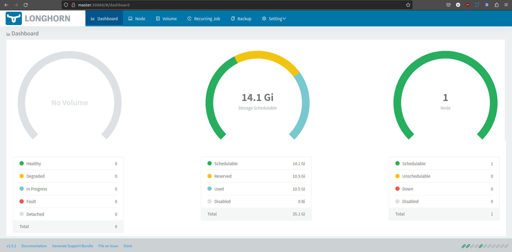
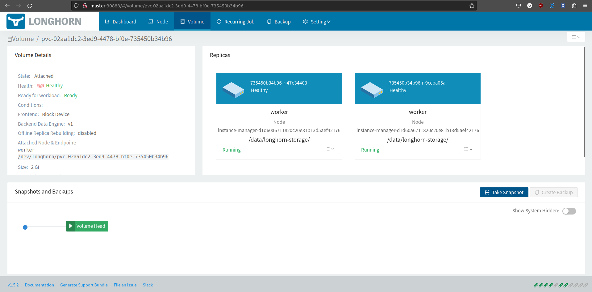

# I. Giới thiệu

## 1. Longhorn là gì?

Longhorn là một hệ thống lưu trữ khối phân tán nhẹ, đáng tin cậy và dễ sử dụng cho Kubernetes.

Longhorn là phần mềm mã nguồn mở và miễn phí. Ban đầu được phát triển bởi Rancher Labs, hiện nay nó đang được phát triển như một dự án ủy quyền của Cloud Native Computing Foundation

<p align="center"><i>(Nguồn: <a href="">https://longhorn.io/docs/1.5.2/concepts/</a>)</i></p>

Tìm hiểu kỹ hơn: https://longhorn.io/docs/1.5.2/what-is-longhorn

## 2. So sánh với NFS

Longhorn và NFS đều là giải pháp lưu trữ, nhưng chúng có một số khác biệt quan trọng:
- Kiểu Lưu Trữ: 
    + Longhorn: Longhorn cung cấp lưu trữ phân tán và có khả năng chống chịu sự cố. Nó sử dụng các replica và snapshot để đảm bảo độ tin cậy và khả năng khôi phục.
    + NFS: NFS (Network File System) là một giao thức lưu trữ file trên mạng. Nó cung cấp một phương tiện chia sẻ tệp đơn giản giữa các máy chủ và máy khách.
- Phân Tán và Chịu Sự Cố:
    + Longhorn: Thường được sử dụng trong môi trường Kubernetes, Longhorn có khả năng chịu sự cố và có thể triển khai dễ dàng trên các node khác nhau. Nó hỗ trợ tính toàn vẹn và đảm bảo tính sẵn sàng của dữ liệu.
    + NFS: NFS thường được triển khai trong môi trường tập trung và có thể gặp khó khăn khi đối mặt với các vấn đề sự cố hoặc khi triển khai trên nhiều node.
- Quản Lý:
    + Longhorn: Cung cấp một giao diện quản lý đồ họa và tính năng như snapshot để quản lý và bảo vệ dữ liệu.
    + NFS: NFS thường được quản lý thông qua các cấu hình trên máy chủ và có thể yêu cầu một số cấu hình phức tạp.
- Tích Hợp với Kubernetes:
    + Longhorn: Được thiết kế đặc biệt cho việc triển khai trên Kubernetes và cung cấp tích hợp tốt với các công cụ quản lý và triển khai của Kubernetes.
    + NFS: Cũng có thể sử dụng trong môi trường Kubernetes, nhưng không được tối ưu hóa cho việc này như Longhorn.
- Hiệu Suất và Độ Trễ:
    + Longhorn: Cung cấp hiệu suất tốt và độ trễ thấp cho các ứng dụng đòi hỏi nhiều I/O.
    + NFS: Có thể có hiệu suất tốt, nhưng có thể không phù hợp cho các ứng dụng đòi hỏi độ trễ thấp như cơ sở dữ liệu.


# II. Cài đặt Longhorn

Ta sẽ có 2 phần:
- Longhorn storage: Là storage quản lý thiết bị lưu trữ, nó có vai trò giống như NFS Server vậy
- Longhorn storage class: Là một object trên K8S đảm nhiệm việc nhận các yêu cầu tạo Volume trên K8S (PV/PVC) sau đó kết nối với longhorn storage để tạo ra phân vùng lưu trữ trên thiết bị lưu trữ

Các bước thực hiện trong bài lab này như sau:
- Chuẩn bị phân vùng lưu dữ liệu trên các Worker Node
- Cài đặt longhorn storage trên K8S dùng helm chart
- Cài đặt longhorn storage class trên K8S
- Test thử tạo PV/PVC và tạo Pod dùng longhorn storage class


## 1. Chuẩn bị phân vùng lưu trữ

[Thực hiện trên node tất cả các node worker]

```shell
# Tạo folder lưu trữ
sudo mkdir -p /data/longhorn-storage
# open-iscsi cho các Worker Node để nó có thể mount được phân vùng từ longhorn storage
sudo yum -y install iscsi-initiator-utils
```


## 2. Cài đặt Longhorn Storage

[Thực hiện trên node control/local]

### Tạo thư mục chứa resource longhorn-storage
```shell
cd k8s_lab
mkdir longhorn-storage
cd longhorn-storage
```

### Download helm chart Longhorn
```shell
helm repo add longhorn https://charts.longhorn.io
helm repo update
helm search repo longhorn
helm pull longhorn/longhorn
tar -xzf longhorn-1.5.2.tgz
```

### Config file values.yml
```shell
cp longhorn/values.yaml values-longhorn.yaml
nano values-longhorn.yaml
```
Sau đó thay đổi những tham số sau trong file:
>Lưu ý: ở đây mình chưa động gì tới haproxy với nginx-ingress nên để expose service ra bên ngoài thì trước mắt tạm thời sẽ dùng node port đã cho nó tiện.

    service:
    ui:
        #type: ClusterIP
        type: NodePort
        nodePort: 30888
    manager:
        type: ClusterIP
        
    defaultDataPath: /data/longhorn-storage/
    replicaSoftAntiAffinity: true
    storageMinimalAvailablePercentage: 15
    upgradeChecker: false
    defaultReplicaCount: 2
    backupstorePollInterval: 500
    nodeDownPodDeletionPolicy: do-nothing
    guaranteedInstanceManagerCPU: 15

    ingress:  
        enabled: true
        ingressClassName: longhorn-storage-ingress
        host: longhorn-ui.trungle.com

    namespaceOverride: "storage"

### Install with Helm
```shell
helm upgrade --install longhorn-storage -n storage -f values-longhorn.yaml longhorn-1.5.2.tgz 
```
Đứng lên đi lại vận động chút chờ Longhorn được setup thôi. Nếu tất cả pods đều **running** như bên dưới thì thành công rồi đó! 😍

    trungle@tpp-lab-058:~/learn-code/k8s/k8s_lab/longhorn-storage$ kubectl -n storage get pods
    NAME                                                              READY   STATUS    RESTARTS      AGE
    csi-attacher-759f487c5-4cxgq                                      1/1     Running   0             2m34s
    csi-attacher-759f487c5-mhrrk                                      1/1     Running   0             2m34s
    csi-attacher-759f487c5-ncxvm                                      1/1     Running   0             2m34s
    csi-provisioner-6df8547696-9xk4r                                  1/1     Running   0             2m34s
    csi-provisioner-6df8547696-sd5fk                                  1/1     Running   0             2m34s
    csi-provisioner-6df8547696-zd8tz                                  1/1     Running   0             2m34s
    csi-resizer-6bf6dbcb4-6sx6f                                       1/1     Running   0             2m34s
    csi-resizer-6bf6dbcb4-dh965                                       1/1     Running   0             2m34s
    csi-resizer-6bf6dbcb4-wvfk4                                       1/1     Running   0             2m34s
    csi-snapshotter-69d7b7b84-57w52                                   1/1     Running   0             2m34s
    csi-snapshotter-69d7b7b84-lfjzg                                   1/1     Running   0             2m34s
    csi-snapshotter-69d7b7b84-v4hw4                                   1/1     Running   0             2m34s
    engine-image-ei-65224a4b-2zxl9                                    1/1     Running   0             2m41s
    instance-manager-d1d60a6711820c20e81b13d5aef42176                 1/1     Running   0             2m42s
    longhorn-csi-plugin-qrs9m                                         3/3     Running   0             2m33s
    longhorn-driver-deployer-f6dd6f84f-d9tlw                          1/1     Running   0             3m4s
    longhorn-manager-l4hd4                                            1/1     Running   0             3m4s
    longhorn-ui-5c65b7cb95-8vc8w                                      1/1     Running   0             3m4s
    longhorn-ui-5c65b7cb95-bt52s                                      1/1     Running   0             3m4s
    nfs-storage-delete-nfs-subdir-external-provisioner-776d59727vk6   1/1     Running   0             129m
    nfs-storage-retain-nfs-subdir-external-provisioner-56f86fcd4bpt   1/1     Running   1 (84m ago)   130m

Giờ thì truy cập vô UI của Longhorn xem cái nào (truy cập IP của node master nhé!): http://192.168.61.128:30888 hoặc http://master:30888
<p align="center"></p>


## 3. Cài đặt longhorn storage class

### Tạo file config
Giờ tạo 2 storage class tương ứng cho Retain và Delete.

**longhorn-storageclass-delete.yaml**

    kind: StorageClass
    apiVersion: storage.k8s.io/v1
    metadata:
    name: longhorn-storage-delete
    annotations:
        storageclass.kubernetes.io/is-default-class: "true"
    provisioner: driver.longhorn.io
    allowVolumeExpansion: true
    reclaimPolicy: Delete
    volumeBindingMode: Immediate
    parameters:
    numberOfReplicas: "2"
    staleReplicaTimeout: "2880"
    fromBackup: ""
    fsType: "ext4"

**longhorn-storageclass-retain.yaml**

    kind: StorageClass
    apiVersion: storage.k8s.io/v1
    metadata:
    name: longhorn-storage-retain
    annotations:
        storageclass.kubernetes.io/is-default-class: "true"
    provisioner: driver.longhorn.io
    allowVolumeExpansion: true
    reclaimPolicy: Retain
    volumeBindingMode: Immediate
    parameters:
    numberOfReplicas: "2"
    staleReplicaTimeout: "2880"
    fromBackup: ""
    fsType: "ext4"

### Apply 2 file config

    trungle@tpp-lab-058:~/learn-code/k8s/k8s_lab/longhorn-storage$ kubectl apply -f longhorn-storageclass-retain.yaml 
    storageclass.storage.k8s.io/longhorn-storage-retain created
    trungle@tpp-lab-058:~/learn-code/k8s/k8s_lab/longhorn-storage$ kubectl apply -f longhorn-storageclass-delete.yaml 
    storageclass.storage.k8s.io/longhorn-storage-delete created
    trungle@tpp-lab-058:~/learn-code/k8s/k8s_lab/longhorn-storage$ kubectl get sc,pvc,pv
    NAME                                                            PROVISIONER                  RECLAIMPOLICY   VOLUMEBINDINGMODE   ALLOWVOLUMEEXPANSION   AGE
    storageclass.storage.k8s.io/longhorn (default)                  driver.longhorn.io           Delete          Immediate           true                   24m
    storageclass.storage.k8s.io/longhorn-storage-delete (default)   driver.longhorn.io           Delete          Immediate           true                   12s
    storageclass.storage.k8s.io/longhorn-storage-retain (default)   driver.longhorn.io           Retain          Immediate           true                   16s
    storageclass.storage.k8s.io/trungle-nfs-delete                  trungle-nfs-storage-delete   Delete          Immediate           true                   151m
    storageclass.storage.k8s.io/trungle-nfs-retain                  trungle-nfs-storage-retain   Retain          Immediate           true                   152m

Vậy là setup Longhorn cho K8S xong rồi đó. Đi kiểm thử nó ra sao thôi!


## 4. Test thử tạo PV/PVC và tạo Pod dùng longhorn storage class

### Tạo 2 PVC tuơng ứng cho Retain và Delete
**longhorn-pvc-delete.yaml**

    apiVersion: v1
    kind: PersistentVolumeClaim
    metadata:
    name: longhorn-pvc-delete
    spec:
    accessModes:
        #- ReadWriteOnce
        - ReadWriteMany
    storageClassName: longhorn-storage-delete
    resources:
        requests:
        storage: 2Gi

**longhorn-pvc-retain.yaml**

    apiVersion: v1
    kind: PersistentVolumeClaim
    metadata:
    name: longhorn-pvc-retain
    spec:
    accessModes:
        - ReadWriteOnce
    storageClassName: longhorn-storage-retain
    resources:
        requests:
        storage: 2Gi

### Tạo 2 pod sử dụng 2 PVC vừa tạo
**test-pod-longhorn-delete.yaml**

    kind: Pod
    apiVersion: v1
    metadata:
    name: pod-longhorn-delete
    spec:
    volumes:
            - name: longhorn-pvc-delete
            persistentVolumeClaim:
                claimName: longhorn-pvc-delete
    containers:
        - name: my-container
        volumeMounts:
            - name: longhorn-pvc-delete # This is the name of the volume we set at the pod level
            mountPath: /var/simple # Where to mount this directory in our container

        # Now that we have a directory mounted at /var/simple, let's
        # write to a file inside it!
        image: alpine
        command: ["/bin/sh"]
        args: ["-c", "while true; do date >> /var/simple/file.txt; sleep 5; done"]

**test-pod-longhorn-retain.yaml**

    kind: Pod
    apiVersion: v1
    metadata:
    name: pod-longhorn-retain
    spec:
    volumes:
            - name: longhorn-pvc-retain
            persistentVolumeClaim:
                claimName: longhorn-pvc-retain
    containers:
        - name: my-container
        volumeMounts:
            - name: longhorn-pvc-retain # This is the name of the volume we set at the pod level
            mountPath: /var/simple # Where to mount this directory in our container

        # Now that we have a directory mounted at /var/simple, let's
        # write to a file inside it!
        image: alpine
        command: ["/bin/sh"]
        args: ["-c", "while true; do date >> /var/simple/file.txt; sleep 5; done"]

### Apply PVC

    trungle@tpp-lab-058:~/learn-code/k8s/k8s_lab/longhorn-storage$ kubectl apply -f longhorn-pvc-delete.yaml 
    persistentvolumeclaim/longhorn-pvc-delete created
    trungle@tpp-lab-058:~/learn-code/k8s/k8s_lab/longhorn-storage$ kubectl apply -f longhorn-pvc-retain.yaml 
    persistentvolumeclaim/longhorn-pvc-retain created
    trungle@tpp-lab-058:~/learn-code/k8s/k8s_lab/longhorn-storage$ kubectl get pvc
    NAME                  STATUS   VOLUME                                     CAPACITY   ACCESS MODES   STORAGECLASS              AGE
    longhorn-pvc-delete   Bound    pvc-02aa1dc2-3ed9-4478-bf0e-735450b34b96   2Gi        RWX            longhorn-storage-delete   9s
    longhorn-pvc-retain   Bound    pvc-11fbe6f5-757d-423c-9dc6-d57db8901d4c   2Gi        RWO            longhorn-storage-retain   5s

### Apply pod

    trungle@tpp-lab-058:~/learn-code/k8s/k8s_lab/longhorn-storage$ kubectl apply -f test-pod-longhorn-delete.yaml 
    pod/pod-longhorn-delete created
    trungle@tpp-lab-058:~/learn-code/k8s/k8s_lab/longhorn-storage$ kubectl apply -f test-pod-longhorn-retain.yaml 
    pod/pod-longhorn-retain created
    trungle@tpp-lab-058:~/learn-code/k8s/k8s_lab/longhorn-storage$ kubectl get pods
    NAME                  READY   STATUS    RESTARTS   AGE
    pod-longhorn-delete   1/1     Running   0          70s
    pod-longhorn-retain   1/1     Running   0          66s

### Kiểm tra kết quả
[Thực hiện trên node worker]

    [sysadmin@worker ~]$ tree /data
    /data
    └── longhorn-storage
        ├── longhorn-disk.cfg
        └── replicas
            ├── pvc-02aa1dc2-3ed9-4478-bf0e-735450b34b96-1480c2d1 [error opening dir]
            ├── pvc-02aa1dc2-3ed9-4478-bf0e-735450b34b96-db0ab87d [error opening dir]
            ├── pvc-11fbe6f5-757d-423c-9dc6-d57db8901d4c-5780af68 [error opening dir]
            └── pvc-11fbe6f5-757d-423c-9dc6-d57db8901d4c-bf3858e1 [error opening dir]

Như vậy là Longhorn đã tạo ra 4 vùng chứa lưu trữ dữ liệu tương ứng với 2 replicas mối PVC đã tạo lúc nảy tạo foler data đã tạo trên các node worker.

<p align="center"></p>


# III. Tổng kết

Như vậy đã hoàn thành cài đặt Longhorn trên K8S và các Longhorn Class. Khi bạn tạo mới một Pod trên Kubernetes và sử dụng Longhorn làm lưu trữ, Longhorn sẽ thực hiện một số bước quan trọng để đảm bảo tính toàn vẹn và độ tin cậy của dữ liệu:
- Controller Pod Quản lý:
    + Longhorn triển khai Controller Pod để quản lý các replica và các block device.
    + Controller Pod chịu trách nhiệm đảm bảo rằng replica được tạo ra và duy trì đồng bộ trên các node worker.
- Tạo Replica:
    + Khi Pod yêu cầu một block device từ Longhorn, Longhorn tạo một replica (thành phần lưu trữ thực sự) trên một node worker và gán nó cho Pod đó.
    + Nếu Pod di chuyển hoặc một node worker gặp sự cố, replica có thể được di chuyển sang node khác.
- Block Device Cho Pod:
    + Longhorn liên kết block device đã tạo với Pod theo yêu cầu của ứng dụng.
- Replica và Snapshot:
    + Longhorn thực hiện sao chép dữ liệu qua các replicas để đảm bảo độ tin cậy và khả năng khôi phục.
    + Kỹ thuật snapshot được sử dụng để tạo bản sao lưu nhanh chóng của dữ liệu, giúp quản lý và khôi phục trạng thái trước đó.
- High Availability (HA):
    + Nếu một node gặp sự cố, replica trên node đó có thể được khôi phục từ các replica trên các node khác.
    + Điều này giúp đảm bảo tính sẵn sàng của hệ thống và giảm nguy cơ mất dữ liệu.
- Quản Lý và Theo Dõi:
    + Controller Pod liên tục theo dõi trạng thái của replicas và thực hiện các hoạt động quản lý như mở rộng, thu nhỏ, snapshot.

Lưu ý rằng Longhorn sử dụng cơ chế Replica và Snapshot để đảm bảo độ tin cậy và tính linh hoạt trong việc quản lý dữ liệu trên Kubernetes.

Bài viết tiếp theo sẽ nói về Metrics Server và Autoscaling với HPA 😉.