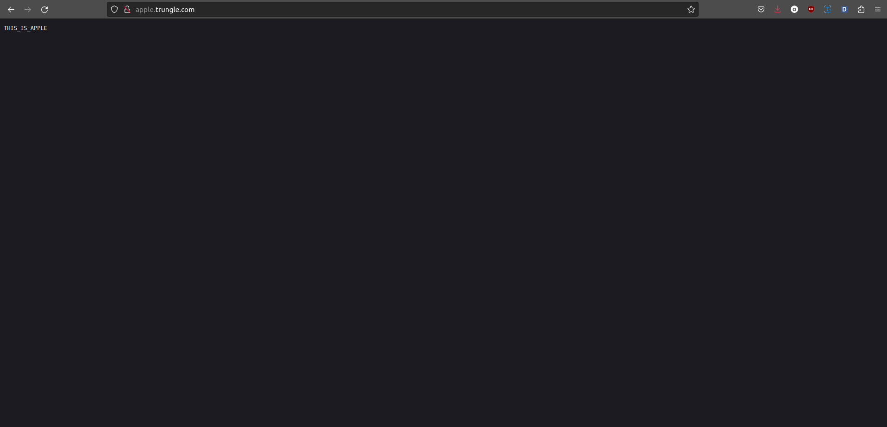

# I. Giới thiệu

Trước tiên, chúng ta cần tìm hiểu về các khái niệm NodePort, ClusterIP, Load Balancing và Nginx là gì? Bài viết này sẽ giúp bạn nắm được ý nghĩa cơ bản của chúng: https://viblo.asia/p/nodeport-vs-ingress-vs-loadbalancer-trong-kubernetes-1VgZvrgRZAw

Ingress phù hợp với các service dạng http/https, còn Node Port đương nhiên cũng dùng được cho http/https nhưng thường thì lại sử dụng cho các trường hợp còn lại. Ví dụ bạn muốn expose Kafka, VerneMQ ra ngoài thì bạn sẽ nghĩ tới node port chứ ko nhất thiết phải qua Nginx-Ingress vì cấu hình Node Port đơn giản và mất ít thao tác hơn.

Một điểm nữa cần lưu ý là service trên K8S khi được expose ra sẽ có entry-point là các IP của các node. Do đó để đảm bảo được Load Balancing thì thông người sẽ cần một service làm nhiệm vụ LB cho các node đó, thường gặp sẽ là Haproxy hoặc Nginx (sẽ được cài trên các K8S node đó). Như vậy Haproxy giải quyết được bài toán Load Balancing. Còn vấn đề dự phòng HA (High Availability) thì chưa.

Để tiếp tục giải quyết bài toán HA cho dịch vụ, thì ta sẽ nghĩ đến giải pháp dùng VIP để tăng khả năng HA, khi một node down thì sẽ vẫn còn node khác xử lý được để không ảnh hưởng dịch vụ. VIP thì thấy phổ biến nhất là Keepalived, hoặc có thể tham khảo PCS.

***Trong phạm vi bài viết này mình sẽ chia sẻ cách cài đặt cấu hình Haproxy/Keepalived và Nginx-Ingress để thực hiện Load Balancing cho các dịch vụ trên trong K8S***.


# II. Nguyên lý hoạt động

## 1. Nginx-Ingress

Nginx-Ingress là một loại Ingress Controller cho Kubernetes, được xây dựng trên cơ sở của Nginx, một web server và reverse proxy server phổ biến. Trong hệ thống Kubernetes, Ingress Controller là một phần quan trọng để quản lý và điều hướng traffic đến các dịch vụ (Services) trong cluster.

Cụ thể, Nginx-Ingress thường được sử dụng để quản lý việc routing (định tuyến) của HTTP và HTTPS traffic đến các ứng dụng chạy trong các Pod của Kubernetes. Nó cung cấp một cách để định cấu hình quy tắc định tuyến (routing rules) thông qua tài liệu được gọi là Ingress Resources.

<p align="center"><i>(Tìm hiểu chi tiết về kiến trúc của NGINX: <a href="https://docs.nginx.com/nginx-ingress-controller/overview/design/">https://docs.nginx.com/nginx-ingress-controller/overview/design/</a>)</i></p>


## 2. Haproxy

Đóng vai trò là Load Balancer của hệ thống, do đó nó là nơi tiếp nhận mọi request tới các dịch vụ. Ta sẽ phải cấu hình cho haproxy để nó hiểu là với các request nào thì forward tới đâu. 

Ví dụ: Ta expose service **prometheus-stack-grafana** bằng Nginx-Ingress ở domain http://grafana.trungle.com với port 80. Client cần kết nối tới domain http://grafana.trungle.com thì Haproxy sẽ cần phải forward nó tới Nginx-Ingress, phần nhiệm vụ còn lại sẽ tiếp tục được Nginx-Ingress xử lý.

<p align="center"><i>(Tìm hiểu chi tiết: <a href="https://viblo.asia/p/huong-dan-su-dung-haproxy-cho-load-balancing-ung-dung-4P856jp95Y3">https://viblo.asia/p/huong-dan-su-dung-haproxy-cho-load-balancing-ung-dung-4P856jp95Y3</a>)</i></p>


## 3. Keepalived

Chúng ta đã có Nginx-Ingress điều hướng request cho các service trong K8S, có HAProxy để cân bằng tải lưu lượng request đến server. Vậy trường hợp server dead thì hệ thống fail ư, cần có một thứ để đảm bảo tính sẵn sàng của server (cho trường hợp có nhiều server, server này chết thì Keepalived sẽ điều hướng đến server khác).

Trong bài lab K8S này, tôi chỉ setup 1 máy master nên cài Keepalived để đảm bảo High Avaiable có vẻ hơi dư thừa, nhưng không sao, cứ thực hành cho biết ^.^

<p align="center"><br><i>(Tìm hiểu chi tiết: <a href="https://cuongquach.com/wp-content/uploads/2018/03/tim-hieu-dich-vu-keepalived.jpg">https://cuongquach.com/wp-content/uploads/2018/03/tim-hieu-dich-vu-keepalived.jpg</a>)</i></p>


# III. Thực hành

## 1. Cài đặt HAProxy và KeepAlived

[Thực hiện trên các node master]

```shell
sudo yum install haproxy -y
sudo yum install keepalived -y

# rsyslog dùng để cấu hình log của HAProxy
sudo yum install -y rsyslog

# Tạo file config để sa này check log của HAProxy cho tiện debug
sudo nano /etc/rsyslog.d/haproxy.conf
```

Copy đoạn nội dung sau paste vào file **haproxy.conf**:

    # Collect log with UDP
    $ModLoad imudp
    $UDPServerAddress 127.0.0.1
    $UDPServerRun 514

    # Creating separate log files based on the severity
    local0.* /var/log/haproxy-traffic.log
    local0.notice /var/log/haproxy-admin.log

Sau đó, restart lại rsyslog để apply file mới tạo:
```shell
sudo service rsyslog restart
```


## 2. Cấu hình Load Balancing

### a. Cấu hình VIP cho KeepAlived

[Thực hiện trên các node master]

Ý tưởng là cấu hình trên các node master có chung 1 VIP, mỗi node sẽ có một độ ưu tiên khác nhau. Và Keepalived sẽ định kỳ check nếu service Haproxy trên node đó mà down thì trọng số của node cũng sẽ giảm theo --> Node khác sẽ lên làm master của cụm và sẽ được gán VIP vào.

Trước tiên, backup file config của Keepalive lỡ có làm bậy còn rollback kịp ^.^
```shell
sudo cp /etc/keepalived/keepalived.conf /etc/keepalived/keepalived.conf.bak
```

Kiểm tra lại cấu hình IP của máy master:

    [sysadmin@master ~]$ ip route
    default via 192.168.61.2 dev ens33 proto dhcp metric 100 
    10.233.64.0/24 dev cni0 proto kernel scope link src 10.233.64.1 
    10.233.65.0/24 via 10.233.65.0 dev flannel.1 onlink 
    192.168.61.0/24 dev ens33 proto kernel scope link src 192.168.61.128 metric 100 

Node master đang dùng IP route **192.168.61.2** với interface **ens33**.
Mở file **keepalived.conf**:
```shell
sudo nano /etc/keepalived/keepalived.conf
```

Để ý đoạn config có cấu trúc như bên dưới trong file, chúng ta sẽ thấy thông số **virtual_router_id 51**.
```conf
vrrp_instance VI_1 {
    state MASTER
    interface eth0
    virtual_router_id 51
    priority 100
    advert_int 1
    authentication {
        auth_type PASS
        auth_pass 1111
    }
    virtual_ipaddress {
        192.168.200.16
        192.168.200.17
        192.168.200.18
    }
}
```

Sau khi có đầy đủ thông số, clear file **keepalived.conf** và paste đoạn config sau vào file với các thông số đã lấy được ở trên:

```conf
vrrp_script haproxy-check {
    script "killall -0 haproxy"
    interval 2
    weight 10
}

vrrp_instance kubernetes {
    state MASTER
    priority 100
    interface ens33
    virtual_router_id 51
    advert_int 2
    authentication {
        auth_type AH
        auth_pass trungle
    }
    virtual_ipaddress {
        192.168.61.127
    }

    track_script {
        haproxy-check
    }
}
```

>Chú ý:
>- **Priority 100** cho node master-1, 99 cho master-2,... giảm dần theo số lượng node master.
>- **interface ens33** interface của route node đang dùng.
>- **virtual_router_id 51** dùng lại từ config mặc định của file.
>- **192.168.61.127** dùng 1 IP chưa được sử dụng để làm IP global cho interface.

Cập nhật xong file thì chạy lệnh sau:
```shell
# Cài gói chạy lệnh killall
sudo yum install psmisc -y 
# Restart lại service
sudo service keepalived restart
```

Kiểm tra kết quả như bên dưới là ngon lành:

    [sysadmin@master ~]$ service keepalived status
    Redirecting to /bin/systemctl status keepalived.service
    ● keepalived.service - LVS and VRRP High Availability Monitor
    Loaded: loaded (/usr/lib/systemd/system/keepalived.service; disabled; vendor preset: disabled)
    Active: active (running) since Fri 2023-12-22 05:22:24 EST; 2s ago
    Process: 60330 ExecStart=/usr/sbin/keepalived $KEEPALIVED_OPTIONS (code=exited, status=0/SUCCESS)
    Main PID: 60331 (keepalived)
        Tasks: 3
    Memory: 1.4M
    CGroup: /system.slice/keepalived.service
            ├─60331 /usr/sbin/keepalived -D
            ├─60332 /usr/sbin/keepalived -D
            └─60333 /usr/sbin/keepalived -D

    Dec 22 05:22:24 master Keepalived_vrrp[60333]: Opening file '/etc/keepalived/keepalived.conf'.
    Dec 22 05:22:24 master Keepalived_vrrp[60333]: WARNING - default user 'keepalived_script' for script execution does not exist - please create.
    Dec 22 05:22:24 master Keepalived_vrrp[60333]: WARNING - script `killall` resolved by path search to `/usr/bin/killall`. Please specify full path.
    Dec 22 05:22:24 master Keepalived_vrrp[60333]: SECURITY VIOLATION - scripts are being executed but script_security not enabled.
    Dec 22 05:22:24 master Keepalived_vrrp[60333]: VRRP_Instance(kubernetes) removing protocol VIPs.
    Dec 22 05:22:24 master Keepalived_vrrp[60333]: Using LinkWatch kernel netlink reflector...
    Dec 22 05:22:24 master Keepalived_vrrp[60333]: VRRP sockpool: [ifindex(2), proto(51), unicast(0), fd(10,11)]
    Dec 22 05:22:24 master Keepalived_vrrp[60333]: /usr/bin/killall -0 haproxy exited with status 1
    Dec 22 05:22:26 master Keepalived_vrrp[60333]: VRRP_Instance(kubernetes) Transition to MASTER STATE
    Dec 22 05:22:27 master Keepalived_vrrp[60333]: /usr/bin/killall -0 haproxy exited with status 1

Kiểm tra lại xem node có tạo ra IP **192.168.61.127** chưa:

    [sysadmin@master ~]$ ip a |grep 192.168.61 -A1 -B2
    2: ens33: <BROADCAST,MULTICAST,UP,LOWER_UP> mtu 1500 qdisc pfifo_fast state UP group default qlen 1000
        link/ether 00:0c:29:b6:9c:6b brd ff:ff:ff:ff:ff:ff
        inet 192.168.61.128/24 brd 192.168.61.255 scope global noprefixroute dynamic ens33
        valid_lft 1759sec preferred_lft 1759sec
        inet 192.168.61.127/32 scope global ens33
        valid_lft forever preferred_lft forever

>Note: Nếu bạn tạo nhiều node master thì config tương tự trên các node master như trên nhé!

### b. Cấu hình HAProxy

Để cấu hình LB cho các service trong K8S thì đơn giản là bạn tạo rule để round-robin các request tới các master-node tại Node Port của Nginx-Ingress là xong. Phần còn lại sẽ con Nginx-Ingress phân tích URL của request và forward tiếp tới các server dựa vào các ingress-rule đã khai báo trên K8S.

Cấu hình service haproxy ở file config **/etc/haproxy/haproxy.cfg**. Ở đây mình có 2 backend, một default là trỏ mọi request tới Nginx-Ingress của K8S, một là check hostname nếu là rancher.trungle.com thì forward tới rancher server đang cài trên máy local đang chạy nó.

***Để truy cập theo domain ở local, cần tạo SSL certificate fake cho chuyên nghiệp ^~^. Dừng lại 1 nhịp, nhảy qua lesson [7_create_ssh_cert](7_create_ssl_cert.md) tạo SSL fake đã ròi làm tiếp nha!***

continue...


## 2. Cài đặt Nginx-Ingress

[Thực hiện trên node control/local]

Rồi, bây giờ quay lại node control (mình sử dụng môi trường laptop làm node control luôn, không có tạo 1 VM control riêng do tài nguyên máy không đủ :v) để cài đặt Nginx-Ingress vào K8S.

Tạo folder mới trong folder chứa resource thực hành k8s nhé:
```shell
cd k8s/k8s_lab/
mkdir nginx-ingress
cd nginx-ingress
```

Cài bằng Helm nhé, vì nó tiện lợi và dễ dùng ~.~
```shell
helm repo add  nginx-stable https://helm.nginx.com/stable
helm repo update
# Kiểm tra xem chart version hiện tại của nginx-stable/nginx-ingress để pull
helm search repo nginx
helm pull nginx-stable/nginx-ingress --version 1.1.0
tar -xzf nginx-ingress-1.1.0.tgz
cp nginx-ingress/values.yaml values-nginx-ingress.yaml
# Mở file values-nginx-ingress lên để chỉnh vài thông số
nano values-nginx-ingress.yaml
```

Sửa 3 thông số sau trong phần **service:**

    ## The type of service to create for the Ingress Controller.
    type: NodePort

    ## The custom NodePort for the HTTP port. Requires controller.service.type set to NodePort.
    nodePort: 30080

    ## The custom NodePort for the HTTPS port. Requires controller.service.type set to NodePort.
    nodePort: 30443

Tạo 1 namespace để quản lý nginx-ingress rồi cài đặt:
```shell
kubectl create ns nginx-ingress
helm -n nginx-ingress upgrade --install nginx-ingress -f values-nginx-ingress.yaml nginx-stable/nginx-ingress
```

Ròi chạy xong thì kiểm tra xem pod của nginx-ingress đã running chưa:

    trungle@tpp-lab-058:~/learn-code/k8s/k8s_lab/nginx-ingress$ kubectl -n nginx-ingress get pods
    NAME                                       READY   STATUS    RESTARTS   AGE
    nginx-ingress-controller-586586dfb-xk5cn   1/1     Running   0          10m

Giờ deploy 1 service để lát test với Load Balancer.
```shell
cd ~/learn-code/k8s/k8s_lab/nginx-ingress
nano apple.yaml
```

Copy and Paste đoạn config này vào file apple.yaml:

```yaml
kind: Pod
apiVersion: v1
metadata:
  name: apple-app
  labels:
    app: apple
spec:
  containers:
    - name: apple-app
      image: hashicorp/http-echo
      args:
        - "-text=THIS_IS_APPLE"

---

kind: Service
apiVersion: v1
metadata:
  name: apple-service
spec:
  selector:
    app: apple
  ports:
    - port: 5678 # Default port for image

---

apiVersion: networking.k8s.io/v1
kind: Ingress
metadata:
  annotations:    
  name: apple.trungle.com  
spec:
  ingressClassName: nginx
  rules:
  - host: apple.trungle.com
    http:
      paths:
      - backend:
          service:
            name: apple-service
            port:
              number: 5678
        path: /
        pathType: Prefix
```

Sau đó install service này:
```shell
kubectl apply -f apple.yaml
```

    trungle@tpp-lab-058:~/learn-code/k8s/k8s_lab/nginx-ingress$ kubectl get pods
    NAME        READY   STATUS    RESTARTS   AGE
    apple-app   1/1     Running   0          5m57s

Như vậy là xong, theo lý thuyết khi truy cập domain http://apple.trungle.com thì nó sẽ kết nối đến Apple app qua service **apple-service**


## 3. Cấu hình haproxy

[Thực hiện trên các node master]

Trước tiên, bakup file **haproxy.cfg** trước đã:
```shell
sudo cp /etc/haproxy/haproxy.cfg /etc/haproxy/haproxy.cfg.bak
```

Cấu hình frontend và backend trong file config như sau:
```cfg
frontend frontend_ssl_443
        bind :80
        bind *:443 ssl crt /etc/haproxy/ssl/trungle_app.pem
        mode http
        option httpclose
        option forwardfor
        reqadd X-Forwarded-Proto:\ https
        cookie  SRVNAME insert indirect nocache
        default_backend backend_ingress

        acl rancher hdr_dom(host) -i rancher.trungle.com
        use_backend backend_rancher if rancher

backend backend_ingress
        mode    http
        stats   enable
        stats   auth username:password
        balance roundrobin
        server  master 192.168.61.128:30080 cookie p1 weight 1 check inter 2000

backend backend_rancher
        mode    http
        stats   enable
        stats   auth username:password
        balance roundrobin
        server  rancher 192.168.61.1:6860 cookie p1 weight 1 check inter 2000
```

>Trong đó:
>- /etc/haproxy/ssl/trungle_app.pem: đường dẫn file trungle_app.pem đã tạo ra ở phần [tạo SSL Cert](./7_create_ssl_cert.md).
>- default_backend backend_ingress: mặc định backend sẽ trỏ sang server k8s.
>- -i rancher.trungle.com: nếu truy cập địa chỉ này sẽ chuyển hướng đến server host rancher.
>- master 192.168.61.128:30080: Danh sách IP các node master. Ở đây, mình chỉ host 1 master nên chỉ khai báo 1 IP, port 30080 là port HTTP expose của ingress-nginx trên K8S.
>- rancher 192.168.61.1:6860: Mapping rancher đến IP local và port rancher ở máy loal. Rancher mình đang host trên máy local ở dạng container thông qua port mapping 80:6860. Do đó, ở các node master, cần khai báo IP 192.168.61.1 và file **/etc/hosts** để server có thể mapping được.

Sau khi edit xong file **haproxy.cfg** thì restart lại service:
```shell
sudo systemctl restart haproxy
```

    trungle@tpp-lab-058:~$ docker ps
    CONTAINER ID   IMAGE                    COMMAND           CREATED       STATUS       PORTS                                                                            NAMES
    082d972984d2   rancher/rancher:v2.7.3   "entrypoint.sh"   7 weeks ago   Up 9 hours   0.0.0.0:6860->80/tcp, :::6860->80/tcp, 0.0.0.0:6868->443/tcp, :::6868->443/tcp   rancher-server

[Thực hiện trên node client]

Khai báo hostname để trỏ đến IP server K8S nhé:
```shell
sudo nano /etc/hosts

# Khái báo IP và hostname
192.168.61.128 master
192.168.61.129 worker
192.168.61.127 apple.trungle.com
192.168.61.127 rancher.trungle.com

# Sau đó save file hosts
```

<p align="center"></p>

<p align="center"></p>

Yeah! Vậy là đã hoàn thành việc config hostname cho các ứng dụng rồi đó. Sau này khi deploy ứng dụng với ingress dạng *.trungle.com thì ở máy local sẽ tự động điều hướng vào ứng dụng.

Test xong rồi, giờ làm sao xoá tất cả resource liên quan đến apple-app? Đơn giản, chạy lệnh delete với file yaml đã setp lúc trước là được.

    trungle@tpp-lab-058:~/learn-code/k8s/k8s_lab$ kubectl delete -f nginx-ingress/apple.yaml 
    pod "apple-app" deleted
    service "apple-service" deleted
    ingress.networking.k8s.io "apple.trungle.com" deleted


# IV. Tổng kết

Bắt đầu từ lab này chúng ta thấy lượng kiến thức về K8S bắt đầu nhiều hơn rồi. Ôi, docs lại cả lý thuyết làm bài lab dài quá, nên từ bài lab tiếp theo mình chỉ note lại step by step thực hành thôi, lý thuyết các bạn xem ở [bài viết gốc](https://viblo.asia/s/chinh-phuc-kubernetes-tu-so-0-GJ59jLJaKX2) nhé, nếu có kiến thức gì mới hoặc hay ho mình mới note lại nhé (^o^).