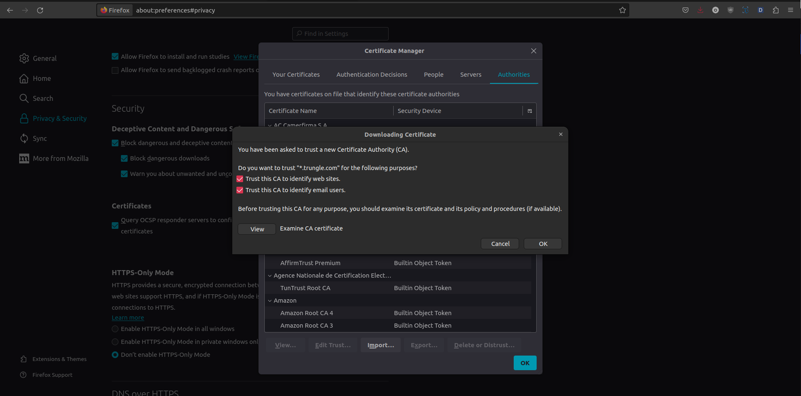
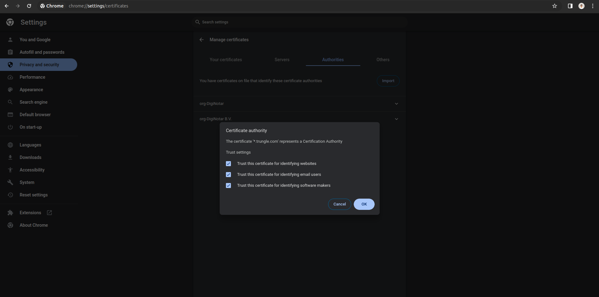

# I. Giới thiệu

SSL (Secure Sockets Layer) Certification là một loại chứng chỉ số học được sử dụng để bảo vệ thông tin truyền tải giữa máy chủ và trình duyệt web. Chứng chỉ này đảm bảo rằng dữ liệu được truyền qua mạng là an toàn và được mã hóa.

SSL Certification thường đi kèm với một cặp khóa (public key và private key) và được ký bởi một tổ chức chứng thực (Certificate Authority - CA) đáng tin cậy. Công nghệ SSL giúp tạo một kênh an toàn giữa máy chủ và người dùng, đảm bảo rằng thông tin như thông tin đăng nhập, dữ liệu cá nhân, và giao dịch tài chính không bị lộ khi chúng đi qua Internet.

TÌm hiểu thêm: https://www.kaspersky.com/resource-center/definitions/what-is-a-ssl-certificate

<p align="center"><br><i>(Tìm hiểu chi tiết: <a href="https://images.viblo.asia/85aac9f5-c987-44b1-9540-2f45c8d857f4.png">https://images.viblo.asia/85aac9f5-c987-44b1-9540-2f45c8d857f4.png</a>)</i></p>


# II. Tạo Cert local

## 1. Tạo file rootCA.key

[Thực hiện trên node master]

```shell
openssl genrsa -des3 -out rootCA.key 2048
```
    # Nhập pass bạn muốn, ở đây mình nhập 'sysadmin'
    Enter pass phrase for rootCA.key:sysadmin
    Verifying - Enter pass phrase for rootCA.key:sysadmin


## 2. Tạo file rootCA.pem từ file rootCA.pem vừa tạo

[Thực hiện trên node master]
```shell
openssl req -x509 -new -nodes -key rootCA.key -sha256 -days 1825 -out rootCA.pem
```
Sau đó nhập pass lúc tạo file rootCA.key vào, ở đây mình nhập 'sysadmin'. Nhập thông tin config tuỳ ý, có thể tham khảo bên dưới:

    Enter pass phrase for rootCA.key:
    You are about to be asked to enter information that will be incorporated
    into your certificate request.
    What you are about to enter is what is called a Distinguished Name or a DN.
    There are quite a few fields but you can leave some blank
    For some fields there will be a default value,
    If you enter '.', the field will be left blank.
    -----
    Country Name (2 letter code) [XX]:VN
    State or Province Name (full name) []:HCM
    Locality Name (eg, city) [Default City]:HCM
    Organization Name (eg, company) [Default Company Ltd]:TrungLe
    Organizational Unit Name (eg, section) []:TrungLe_Unit
    Common Name (eg, your name or your server's hostname) []:*.trungle.com
    Email Address []:trungle@gmail.com

Sau khi thực hiện 2 bước trên, chúng ta sẽ có 2 file .key và .pem:

    [sysadmin@master ~]$ ls -lrt
    total 8
    -rw-rw-r--. 1 sysadmin sysadmin 1743 Jan  2 03:03 rootCA.key
    -rw-rw-r--. 1 sysadmin sysadmin 1424 Jan  2 03:09 rootCA.pem


## 3. Upload file rootCA.pem vào trình duyệt ở máy client

[Thực hiện trên máy local]

Bây giờ để có thể truy cập vào serive thông qua tên miền thì ở trình duyệt máy local cần gắn file .pem vào xác thực.

Copy file rootCA.pem từ node master về local:
```shell
scp sysadmin@master:~/rootCA.pem ~/Downloads/rootCA-k8s.pem
```

Giờ thì import file .pem vào browser thôi!

Đối với **firefox**: 
1. Truy cập đường dẫn: [about:preferences#privacy](about:preferences#privacy)
2. Kéo xuống phần **Certificates** -> click chọn **View Certificates...** -> click chọn **Import...** -> chọn file **rootCA-k8s.pem** -> tích chọn 2 checkbox -> click **OK**

<p align="center"></p>

Đối với **Chrome**:
1. Truy cập: [chrome://settings/certificates](chrome://settings/certificates)
2. Click sang tab **Authorities** -> click **Import** -> chọn file **rootCA-k8s.pem** -> tích chọn 3 checkbox -> chọn OK.

<p align="center"></p>


## 4. Tạo SSL Cert cho ứng dụng web ở local

[Thực hiện trên node master]

Tạo file **opensl.cnf**:
```shell
nano opensl.cnf
```
Nhập thông tin như bên dưới:
```cnf
[req]
distinguished_name = req_distinguished_name
req_extensions = v3_req
[req_distinguished_name]
countryName = VN
countryName_default = VN
stateOrProvinceName = HCM
stateOrProvinceName_default = HCM
localityName = HCM
localityName_default = HCM
organizationalUnitName = TrungLe_Unit
organizationalUnitName_default = TrungLe_Unit
commonName = *.trungle.com
commonName_max = 64
[ v3_req ]
# Extensions to add to a certificate request
basicConstraints = CA:FALSE
keyUsage = nonRepudiation, digitalSignature, keyEncipherment
subjectAltName = @alt_names
[alt_names]
DNS.1 = *.trungle.com
```

Tạo file trungle_app.key key:
```shell
sudo openssl genrsa -out trungle_app.key 2048
```

Tạo file trungle_app.csr:
```shell
sudo openssl req -new -out trungle_app.csr -key trungle_app.key -config openssl.cnf 
```

Nhấn enter để bỏ qua các input bên dưới:

    You are about to be asked to enter information that will be incorporated
    into your certificate request.
    What you are about to enter is what is called a Distinguished Name or a DN.
    There are quite a few fields but you can leave some blank
    For some fields there will be a default value,
    If you enter '.', the field will be left blank.
    -----
    VN [VN]:
    HCM [HCM]:
    HCM [HCM]:
    TrungLe_Unit [TrungLe_Unit]:
    *.trungle.com []:

Tạo file **trungle_app.crt**:
```shell
sudo openssl x509 -req -days 3650 -in trungle_app.csr -CA rootCA.pem -CAkey rootCA.key -CAcreateserial -out trungle_app.crt -extensions v3_req -extfile openssl.cnf
```

Rồi xem lại ta đã có 3 file **trungle_app: .key, .csr, .crt** 

    [sysadmin@master ~]$ ls -lrt
    total 28
    -rw-rw-r--. 1 sysadmin sysadmin 1743 Jan  2 03:03 rootCA.key
    -rw-rw-r--. 1 sysadmin sysadmin 1424 Jan  2 03:09 rootCA.pem
    -rw-rw-r--. 1 sysadmin sysadmin  586 Jan  2 04:18 openssl.cnf
    -rw-r--r--. 1 root     root     1675 Jan  2 04:21 trungle_app.key
    -rw-r--r--. 1 root     root     1041 Jan  2 04:22 trungle_app.csr
    -rw-r--r--. 1 root     root       17 Jan  2 04:30 rootCA.srl
    -rw-r--r--. 1 root     root     1281 Jan  2 04:30 trungle_app.crt

Tạo file trungle_app.pem từ 3 file trên:
```shell
cat trungle_app.key > trungle_app.pem
cat trungle_app.csr  >> trungle_app.pem
cat trungle_app.crt  >> trungle_app.pem
```

Như vậy đã tạo xong SSL Cert ở Local cho ứng dụng.