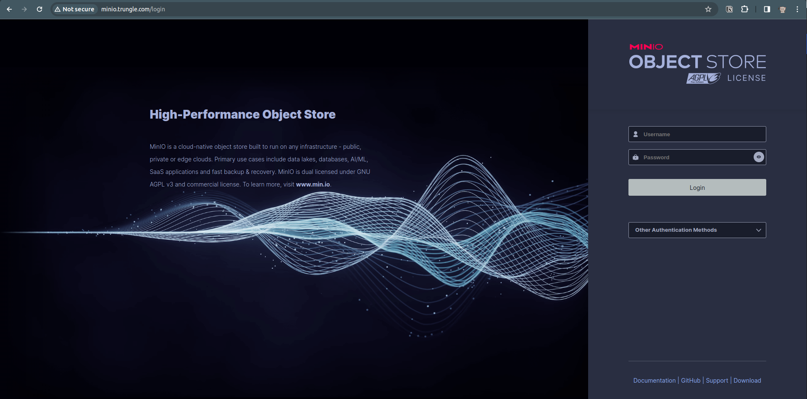
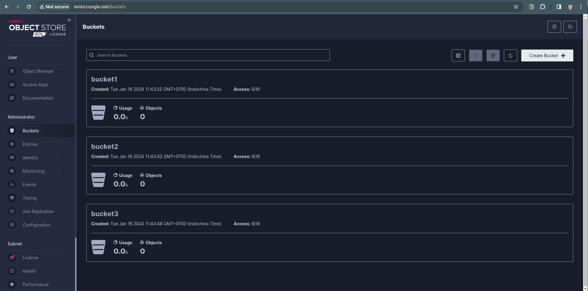
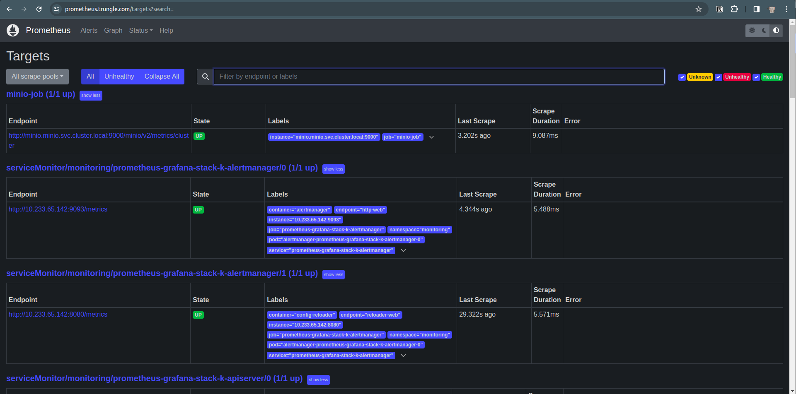
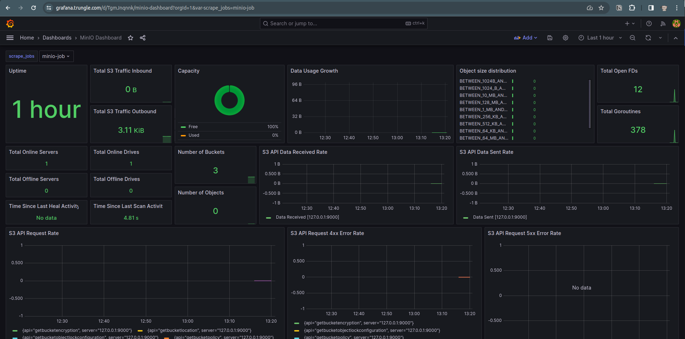
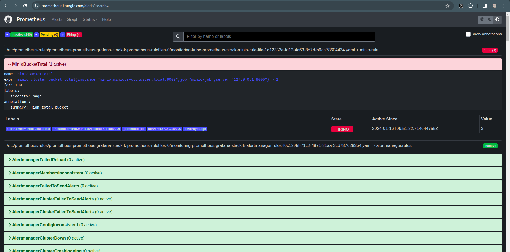

# I. Cài đặt Prometheus và Grafana trên K8S bằng Helm

Ở bài lab [2_setup_k8s_with_kubespray](./2_setup_k8s_with_kubespray.md) chúng ta đã cài Rancher có công dụng quản lý các cụm K8S rồi thì cài Prometheus chi nữa ta? Rancher và Prometheus có mục tiêu sử dụng khác nhau:
- **Rancher**: tập trung vào quản lý cụm Kubernetes, cung cấp một giao diện người dùng cho quản lý cụm và đơn giản hóa triển khai ứng dụng.
- **Prometheus**: chủ yếu là một công cụ giám sát và cảnh báo được thiết kế để thu thập và phân tích số liệu chuỗi thời gian, thường được sử dụng kết hợp với Grafana để hiển thị số liệu.

Phần cài đặt sẽ bao gồm: Prometheus, Alert Manager và Grafana.

[Thực hiện ở node control/local]

### Tạo thư mục chứa file cấu hình cài đặt Prometheus

```shell
cd ~/learn-code/k8s/k8s_lab/
mkdir prometheus
cd prometheus
```

### Download helm-chart của Prometheus

```shell
helm repo add prometheus-community https://prometheus-community.github.io/helm-charts
helm repo add stable https://charts.helm.sh/stable
helm repo update
helm search repo prometheus |egrep "stack|CHART"
# Pull helm-chart prometheus-community/kube-prometheus-stack về nhé!
helm pull prometheus-community/kube-prometheus-stack --version 55.5.1
tar -xzf kube-prometheus-stack-55.5.1.tgz
cp kube-prometheus-stack/values.yaml values-prometheus.yaml
```

### Cấu hình file values-prometheus.yaml

Enable ingress của **Alert Manager**:
```yaml
alertmanager:
  ingress:
    enabled: true
    ingressClassName: nginx
    hosts:
      - alertmanager.trungle.com
    paths:
    - /
```

Enable ingress của **Grafana**:
```yaml
grafana:
  # Đổi thành password login vào Grafana mà bạn muốn
  adminPassword: sysadmin@123
  ingress:
    enabled: true
    ingressClassName: nginx
    hosts:
      - grafana.trungle.com
    path: 
      - /
```

Enable ingress của **Prometheus**:
```yaml
prometheus:
  ingress:
    enabled: true
    ingressClassName: nginx
    hosts:
      - prometheus.trungle.com
    paths:
      - /
```

Vậy là đã cấu hình xong file helm, nhanh gọn lẹ =))

### Cài đặt lên K8S

Tạo namespace để dễ maintain:
```shell
kubectl create ns monitoring
```

Install thôi!
```shell
helm -n monitoring upgrade --install prometheus-grafana-stack -f values-prometheus.yaml prometheus-community/kube-prometheus-stack
```

Kết quả như vầy là thành công nha:

    Release "prometheus-grafana-stack" does not exist. Installing it now.
    NAME: prometheus-grafana-stack
    LAST DEPLOYED: Wed Jan  3 11:33:48 2024
    NAMESPACE: monitoring
    STATUS: deployed
    REVISION: 1
    NOTES:
    kube-prometheus-stack has been installed. Check its status by running:
    kubectl --namespace monitoring get pods -l "release=prometheus-grafana-stack"

    Visit https://github.com/prometheus-operator/kube-prometheus for instructions on how to create & configure Alertmanager and Prometheus instances using the Operator.

    trungle@tpp-lab-058:~/learn-code/k8s/k8s_lab/prometheus$ kubectl -n monitoring get all
    NAME                                                               READY   STATUS    RESTARTS   AGE
    pod/alertmanager-prometheus-grafana-stack-k-alertmanager-0         2/2     Running   0          59s
    pod/prometheus-grafana-stack-7cd56fcc89-qtlxs                      3/3     Running   0          69s
    pod/prometheus-grafana-stack-k-operator-85d8b858d8-jxc4b           1/1     Running   0          69s
    pod/prometheus-grafana-stack-kube-state-metrics-865955f67b-4g8hr   1/1     Running   0          69s
    pod/prometheus-grafana-stack-prometheus-node-exporter-c5s5g        1/1     Running   0          69s
    pod/prometheus-grafana-stack-prometheus-node-exporter-x9xlv        1/1     Running   0          69s
    pod/prometheus-prometheus-grafana-stack-k-prometheus-0             1/2     Running   0          58s

    NAME                                                        TYPE        CLUSTER-IP      EXTERNAL-IP   PORT(S)                      AGE
    service/alertmanager-operated                               ClusterIP   None            <none>        9093/TCP,9094/TCP,9094/UDP   59s
    service/prometheus-grafana-stack                            ClusterIP   10.233.42.8     <none>        80/TCP                       69s
    service/prometheus-grafana-stack-k-alertmanager             ClusterIP   10.233.45.145   <none>        9093/TCP,8080/TCP            69s
    service/prometheus-grafana-stack-k-operator                 ClusterIP   10.233.44.71    <none>        443/TCP                      69s
    service/prometheus-grafana-stack-k-prometheus               ClusterIP   10.233.16.62    <none>        9090/TCP,8080/TCP            69s
    service/prometheus-grafana-stack-kube-state-metrics         ClusterIP   10.233.51.119   <none>        8080/TCP                     69s
    service/prometheus-grafana-stack-prometheus-node-exporter   ClusterIP   10.233.5.143    <none>        9100/TCP                     69s
    service/prometheus-operated                                 ClusterIP   None            <none>        9090/TCP                     58s

    NAME                                                               DESIRED   CURRENT   READY   UP-TO-DATE   AVAILABLE   NODE SELECTOR            AGE
    daemonset.apps/prometheus-grafana-stack-prometheus-node-exporter   2         2         2       2            2           kubernetes.io/os=linux   69s

    NAME                                                          READY   UP-TO-DATE   AVAILABLE   AGE
    deployment.apps/prometheus-grafana-stack                      1/1     1            1           69s
    deployment.apps/prometheus-grafana-stack-k-operator           1/1     1            1           69s
    deployment.apps/prometheus-grafana-stack-kube-state-metrics   1/1     1            1           69s

    NAME                                                                     DESIRED   CURRENT   READY   AGE
    replicaset.apps/prometheus-grafana-stack-7cd56fcc89                      1         1         1       69s
    replicaset.apps/prometheus-grafana-stack-k-operator-85d8b858d8           1         1         1       69s
    replicaset.apps/prometheus-grafana-stack-kube-state-metrics-865955f67b   1         1         1       69s

    NAME                                                                    READY   AGE
    statefulset.apps/alertmanager-prometheus-grafana-stack-k-alertmanager   1/1     59s
    statefulset.apps/prometheus-prometheus-grafana-stack-k-prometheus       0/1     58s

### Kiểm tra truy cập từ Client

[Thực hiện trên local/control]

Để có thể truy cập vào Prometheus thông qua domain ingress đã tạo thì cần khai báo host trong file hosts ở máy Client:
```shell
sudo nano /etc/hosts

# Khai báo IP và host của 3 ứng dụng này vào
192.168.61.127 grafana.trungle.com
192.168.61.127 alertmanager.trungle.com
192.168.61.127 prometheus.trungle.com
```

Xong rồi thì truy cập xem thử có được hem?

<p align="center"></p>

Grafana có sẵn rất nhiều bộ template dashbaord visually. Ví dụ bạn muốn tạo dashboard để monitoring các Node trong K8S thì có thể tham khảo: https://grafana.com/grafana/dashboards/15759-kubernetes-views-nodes/

Để cài template dashboard này vào Grafana:

1. Truy cập vào Grafana: [grafana.trungle.com](http://grafana.trungle.com/)
2. Vào phần Dashboard ([Home > Dasboard](http://grafana.trungle.com/dashboards)) -> Chọn button **New** -> Chọn **Import**
3. Nhập ID Dashboard template (ở đây là 15759) vào -> chọn **Load** -> Chọn **Import**

Sau khi import, bạn sẽ thấy UI xịn xò như sau:
<p align="center"></p>


# II. Giám sát service trên K8S bằng Prometheus và Grafana

Bây giờ, chúng ta sẽ cài đặt Minio để tìm hiểu về tính năng giám sát và gửi alert của Promtheus/Grafana nhé! Minio là một open-source giống với dịch vụ AWS S3 nhưng được host ở local.

Các bước thực hiện:
- Tải helm-chart của Minio
- Cấu hình file values.yaml
- Install bằng helm
- Cấu hình Prometheus lấy metrics từ Minio
- Tạo dashboard Grafana
- Cấu hình cảnh báo với Alert Prometheus

### Tải helm-chart

```shell
cd ~/learn-code/k8s/k8s_lab/prometheus
helm repo add bitnami https://charts.bitnami.com/bitnami
helm search repo minio
helm pull bitnami/minio
tar -xzf minio-13.0.2.tgz
cp minio/values.yaml values-minio.yaml
```

### Cấu hình file values-minio.yaml
Sau đó, sửa giá trị của các biến sau trong file **values-minio.yaml**:
```yaml
auth:
  rootPassword: "sysadmin@123"
ingress:
  enabled: true
  ingressClassName: "nginx"
  hostname: minio.trungle.com
  annotations:
    prometheus.io/scrape: 'true'
persistence:
  storageClass: "longhorn-storage-retain"
  size: 1Gi
```

### Install bằng helm
```shell
kubectl create ns minio
helm -n minio upgrade --install minio -f values-minio.yaml bitnami/minio
```

Chờ một chút để pod tạo xong thì kiểm tra xem tất cả đã ready chưa:

    trungle@tpp-lab-058:~/learn-code/k8s/k8s_lab/prometheus$ kubectl get all -n minio
    NAME                        READY   STATUS    RESTARTS   AGE
    pod/minio-c94d4b775-kmg82   1/1     Running   0          61s

    NAME            TYPE        CLUSTER-IP     EXTERNAL-IP   PORT(S)             AGE
    service/minio   ClusterIP   10.233.6.248   <none>        9000/TCP,9001/TCP   61s

    NAME                    READY   UP-TO-DATE   AVAILABLE   AGE
    deployment.apps/minio   1/1     1            1           61s

    NAME                              DESIRED   CURRENT   READY   AGE
    replicaset.apps/minio-c94d4b775   1         1         1       61s

Ok, giờ thì thêm config url của minio ***(192.168.61.127 minio.trungle.com)*** vào file **/etc/hosts** trên máy local để kiểm tra:
<p align="center"></p>

Login vào bằng **username: admin và password: sysadmin@123** như đã config lúc trước. Sau đó, tạo 3 bucket:
<p align="center"></p>

### Cấu hình Prometheus lấy metrics từ Minio

Để ý lại file **values-minio.yaml** có đoạn expose metrics ***/minio/v2/metrics/cluster***, chúng ta sẽ config promethues lấy thông minio từ nó. Bây giờ thì quay lại file cấu hình promentheus trước đây **values-prometheus.yaml** để update phần scape-config cho minio như sau:
```yaml
additionalScrapeConfigs:
- job_name: 'minio-job'
  metrics_path: /minio/v2/metrics/cluster
  scheme: http
  static_configs:       
  - targets: ['minio.minio.svc.cluster.local:9000']
```
>Trong đó: **minio.minio.svc.cluster.local:9000** được khai báo theo format: < service-name >.< namespace >.< cluster-name >
>- serivce-name: lúc nảy chúng ta install minio bằng helm với tên **minio**
>- namespace: chúng ta install minio trên namespace cũng tên minio đã tạo trước đó
>- cluster-name: trong file **values-minio.yaml** có khai báo ***clusterDomain: cluster.local***

Sau đó, chạy lệnh helm để update lại prometheus:
```shell
helm -n monitoring upgrade --install prometheus-grafana-stack -f values-prometheus.yaml prometheus-community/kube-prometheus-stack
```

Chờ một lát để prometheus chạy lại, rồi truy cập vào prometheus.trungle.com xem có config của minio chưa nhé!
<p align="center"></p>

### Tạo dashboard Grafana

Google để tìm template dashboard minio đẹp nha (ví dụ: https://grafana.com/grafana/dashboards/13502-minio-dashboard/). Sau đó copy ID dashboard rồi import vào Grafana thôi, sau đó bạn có thể giám sát các chỉ số của minio trực quan rồi đó.
<p align="center"></p>

### Cấu hình cảnh báo với Alert Prometheus

Mở file **values-prometheus.yaml** để thêm rule cảnh báo cho minio:
```yaml
additionalPrometheusRules:
 - name: minio-rule-file
   groups:
     - name: minio-rule
       rules:
       - alert: MinioBucketTotal
         expr: minio_cluster_bucket_total{instance="minio.minio.svc.cluster.local:9000", job="minio-job", server="127.0.0.1:9000"} > 2
         for: 10s
         labels:
            severity: page
         annotations:
            summary: High total bucket
```

Rule ở trên dùng để cảnh báo khi số lượng bucket trong minio > 2.
Xong rồi thì chạy lệnh upgrade lại prometheus:
```shell
helm -n monitoring upgrade --install prometheus-grafana-stack -f values-prometheus.yaml prometheus-community/kube-prometheus-stack
```

Chờ một lát thì refresh lại page https://prometheus.trungle.com/alerts?search= để xem kết quả:
<p align="center"></p>

Nice, ở lesson sau chúng ta sẽ tìm hiểu kỹ hơn về monitoring trên Prometheus.