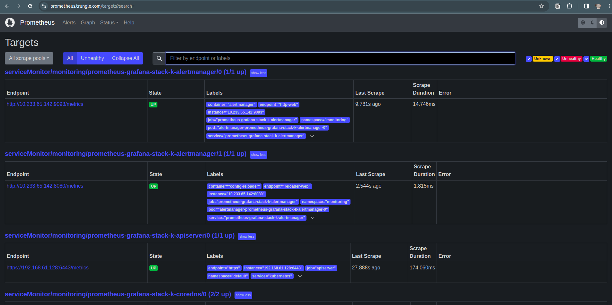

# I. Giới thiệu

Ở lesson này, chúng ta sẽ tìm hiểu cách sử dụng Service Monitor cho giám sát thay vì dùng Scrape Configuration như ở lesson trước. Sau khi config với scrape bạn cũng thấy đấy, cần config chi tiết và update lại prometheus stack, rất mất thời gian và không linh hoạt nếu hệ thống có quá nhiều service cần giám sát.

## Scrape Configuration

### 1. Áp Dụng Đa Dạng

On-Premises và Non-Kubernetes: Scrape configuration thường được sử dụng khi bạn đang chạy Prometheus trực tiếp trên máy chủ hoặc hạ tầng không phải Kubernetes.

Môi Trường Không Thuộc Kubernetes: Cấu hình scrape có thể được sử dụng để giám sát bất kỳ mục tiêu nào có thể truy cập qua mạng và có thể cung cấp metrics qua HTTP.

### 2. Cấu Hình Tường Min

Chỉ Định Trực Tiếp Điểm Đến: Bạn cần cung cấp thông tin chi tiết về nơi mà Prometheus sẽ tìm metrics. Điều này bao gồm job name, target addresses, và các tùy chọn khác.

### 3. Dành Cho Hạ Tầng Không Phải Kubernetes

Scrape configuration phù hợp cho việc giám sát các ứng dụng chạy trên máy chủ, các dịch vụ mà không chạy trong môi trường Kubernetes.

## Service Monitor

### 1. Chỉ Dành Cho Kubernetes

Cụ Thể Cho Kubernetes: Service Monitor là một khái niệm của Prometheus Operator và chủ yếu được sử dụng trong môi trường Kubernetes.

Tích Hợp Chặt Chẽ với Kubernetes: Service Monitor sử dụng Kubernetes API để tự động xác định và cấu hình giám sát cho các dịch vụ chạy trong Kubernetes.

### 2. Tự Động Phát Hiện Dịch Vụ

Không Cần Cấu Hình Chi Tiết: Service Monitor có khả năng tự động phát hiện các dịch vụ dựa trên các nhãn (labels) và annotations của Kubernetes Pods.

Dynamic Configuration: Khi một dịch vụ mới được triển khai trong Kubernetes, Prometheus Operator có thể tự động tạo ra Service Monitor tương ứng.

### 3. Dành Cho Môi Trường Kubernetes

Kubernetes-Aware: Service Monitor là lựa chọn tốt nhất cho việc giám sát ứng dụng chạy trong môi trường Kubernetes, nơi bạn muốn sử dụng tính tự động và linh hoạt của Kubernetes.


# II. Thực hành thiết lập giám giát service bằng Service Monitor

### 1. Sửa config prometheus trong file values-prometheus.yaml

```shell
cd ~/learn-code/k8s/k8s_lab/prometheus
# Update nội dung sau vào file yaml
serviceMonitorSelector:
    matchExpressions:
    - key: app.kubernetes.io/instance
    operator: In
    values:
        - service-monitor
        - nginx-ingress       
        - prometheus-grafana-stack
additionalScrapeConfigs: []
```

>Trong đó: **values** là label được gắn cho app.kubernetes.io/instance ở các service. Dùng lệnh **kubectl get pod -n <namespace> --show-labels** để xem value của các namespace đã deploy service như: monitoring, nginx-ingress.

Chúng ta sẽ chuyển sang dùng service monitor thay cho scrape. Upgrade lại prometheus:
```shell
helm -n monitoring upgrade --install prometheus-grafana-stack -f values-prometheus.yaml prometheus-community/kube-prometheus-stack
```
<p align="center"></p>