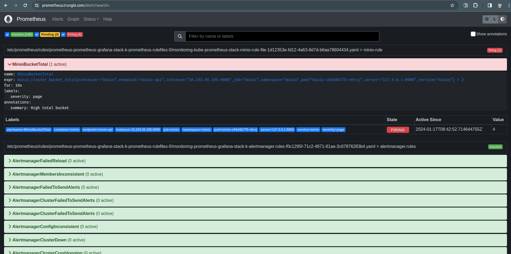

# I. Giới thiệu

Ở lesson này, chúng ta sẽ tìm hiểu cách sử dụng Service Monitor cho giám sát thay vì dùng Scrape Configuration như ở lesson trước. Sau khi config với scrape bạn cũng thấy đấy, cần config chi tiết và update lại prometheus stack, rất mất thời gian và không linh hoạt nếu hệ thống có quá nhiều service cần giám sát.

## Scrape Configuration

### 1. Áp Dụng Đa Dạng

On-Premises và Non-Kubernetes: Scrape configuration thường được sử dụng khi bạn đang chạy Prometheus trực tiếp trên máy chủ hoặc hạ tầng không phải Kubernetes.

Môi Trường Không Thuộc Kubernetes: Cấu hình scrape có thể được sử dụng để giám sát bất kỳ mục tiêu nào có thể truy cập qua mạng và có thể cung cấp metrics qua HTTP.

### 2. Cấu Hình Tường Minh

Chỉ Định Trực Tiếp Điểm Đến: Bạn cần cung cấp thông tin chi tiết về nơi mà Prometheus sẽ tìm metrics. Điều này bao gồm job name, target addresses, và các tùy chọn khác.

### 3. Dành Cho Hạ Tầng Không Phải Kubernetes

Scrape configuration phù hợp cho việc giám sát các ứng dụng chạy trên máy chủ, các dịch vụ mà không chạy trong môi trường Kubernetes.

## Service Monitor

### 1. Chỉ Dành Cho Kubernetes

Cụ Thể Cho Kubernetes: Service Monitor là một khái niệm của Prometheus Operator và chủ yếu được sử dụng trong môi trường Kubernetes.

Tích Hợp Chặt Chẽ với Kubernetes: Service Monitor sử dụng Kubernetes API để tự động xác định và cấu hình giám sát cho các dịch vụ chạy trong Kubernetes.

### 2. Tự Động Phát Hiện Dịch Vụ

Không Cần Cấu Hình Chi Tiết: Service Monitor có khả năng tự động phát hiện các dịch vụ dựa trên các nhãn (labels) và annotations của Kubernetes Pods.

Dynamic Configuration: Khi một dịch vụ mới được triển khai trong Kubernetes, Prometheus Operator có thể tự động tạo ra Service Monitor tương ứng.

### 3. Dành Cho Môi Trường Kubernetes

Kubernetes-Aware: Service Monitor là lựa chọn tốt nhất cho việc giám sát ứng dụng chạy trong môi trường Kubernetes, nơi bạn muốn sử dụng tính tự động và linh hoạt của Kubernetes.


# II. Thực hành thiết lập giám giát service bằng Service Monitor

### 1. Sửa config prometheus trong file values-prometheus.yaml

```shell
cd ~/learn-code/k8s/k8s_lab/prometheus
# Update nội dung sau vào file yaml
serviceMonitorSelector:
    matchExpressions:
    - key: app.kubernetes.io/instance
    operator: In
    values:
        - service-monitor
        - nginx-ingress       
        - prometheus-grafana-stack
additionalScrapeConfigs: []
```

>Trong đó: **values** là label được gắn cho app.kubernetes.io/instance ở các service. Dùng lệnh **kubectl get pod -n < namespace > --show-labels** để xem value của các namespace đã deploy service như: monitoring, nginx-ingress.

Chúng ta sẽ chuyển sang dùng service monitor thay cho scrape. Upgrade lại prometheus:
```shell
helm -n monitoring upgrade --install prometheus-grafana-stack -f values-prometheus.yaml prometheus-community/kube-prometheus-stack
```
<p align="center"></p>

Ngon lành, giờ thì chúng ta có thể linh hoạt việc giám sát các service bằng cách tạo thêm file serviceMonitor.yaml cho mỗi service với label **app.kubernetes.io/instance: service-monitor** đã thiết lập bước ở trên là được.

### 2. Cấu hình lại monitor Minio

Trước tiên chạy lệnh sau để xem thông tin của service minio đã deploy:
```shell
trungle@tpp-lab-058:~/learn-code/k8s/k8s_lab/prometheus$ kubectl describe svc minio -n minio
Name:              minio
Namespace:         minio
Labels:            app.kubernetes.io/instance=minio
                   app.kubernetes.io/managed-by=Helm
                   app.kubernetes.io/name=minio
                   app.kubernetes.io/version=2024.1.13
                   helm.sh/chart=minio-13.0.2
Annotations:       meta.helm.sh/release-name: minio
                   meta.helm.sh/release-namespace: minio
Selector:          app.kubernetes.io/instance=minio,app.kubernetes.io/name=minio
Type:              ClusterIP
IP Family Policy:  SingleStack
IP Families:       IPv4
IP:                10.233.6.248
IPs:               10.233.6.248
Port:              minio-api  9000/TCP
TargetPort:        minio-api/TCP
Endpoints:         10.233.65.195:9000
Port:              minio-console  9001/TCP
TargetPort:        minio-console/TCP
Endpoints:         10.233.65.195:9001
Session Affinity:  None
Events:            <none>
```

Tạo 1 file **serviceMonitor-minio.yaml**
```yaml
apiVersion: monitoring.coreos.com/v1
kind: ServiceMonitor
metadata:
  name: minio-monitor
  # Namespace chứa prometheus
  namespace: monitoring
  labels:
    # Label gán cho ServiceMonitor này để Prometheus đọc được
    app.kubernetes.io/instance: service-monitor    
spec: # Phần này khai báo thông tin của serive Minio đang chạy
  endpoints:
  - port: 9000
    interval: 10s
    scheme: http
    metrics_path: /minio/v2/metrics/cluster
  namespaceSelector:
    matchNames:
    - minio # Namespace minio được deploy
  selector:
    matchLabels:
      app.kubernetes.io/instance: minio # Label instance của minio
```

Sau đó chạy deploy nó thôi:
```shell
cd ~/learn-code/k8s/k8s_lab/prometheus
kubectl apply -f serviceMonitor-minio.yaml
kubectl -n monitoring get servicemonitors.monitoring.coreos.com -l "app.kubernetes.io/instance=service-monitor"
# NAME            AGE
# minio-monitor   6m46s
```

Chờ một chút để Prometheus lấy dữ liệu metrics của Minio:
<p align="center"></p>

Bonus thêm, vì đã chuyển sang dùng service monitor để giám sát minio nên phần config alert minio ở lesson trước sẽ không hoạt động nữa. Do đó, chúng ta sẽ tiến hành update **expr** của config alert.

Vào phần Graph của Prometheus và search **minio_cluster_bucket_total** -> execute để lấy đoạn expr:
<p align="center"></p>

Update lại trong file **values-prometheus.yaml**
```yaml
expr: minio_cluster_bucket_total{container="minio", endpoint="minio-api", instance="10.233.65.195:9000", job="minio", namespace="minio", pod="minio-c94d4b775-n6rxj", server="127.0.0.1:9000", service="minio"} > 2

#Lưu ý: bỏ instance, pod đi vì mỗi lần start lại K8S sẽ tạo pod mới.
```
Rồi upgrade lại prometheus:
```shell
helm -n monitoring upgrade --install prometheus-grafana-stack -f values-prometheus.yaml prometheus-community/kube-prometheus-stack
```

Chờ một chút để prometheus update, thì xem lại nó đã hiện cảnh báo chưa nếu số lượng bucket > 2
<p align="center"></p>

### Thử cấu hình get metrics cho Longhorn

Rồi, giờ thử lấy metrics của Longhorn để visually trên Grafana xem cho chuyên nghiệp nào.

Đầu tiên, lấy thông tin của service bắn metrics để config file yaml:
```shell
trungle@tpp-lab-058:~/learn-code/k8s/k8s_lab/prometheus$ kubectl -n storage describe svc longhorn-backend
Name:              longhorn-backend
Namespace:         storage
Labels:            app=longhorn-manager
                   app.kubernetes.io/instance=longhorn-storage
                   app.kubernetes.io/managed-by=Helm
                   app.kubernetes.io/name=longhorn
                   app.kubernetes.io/version=v1.5.2
                   helm.sh/chart=longhorn-1.5.2
Annotations:       meta.helm.sh/release-name: longhorn-storage
                   meta.helm.sh/release-namespace: storage
Selector:          app=longhorn-manager
Type:              ClusterIP
IP Family Policy:  SingleStack
IP Families:       IPv4
IP:                10.233.5.52
IPs:               10.233.5.52
Port:              manager  9500/TCP
TargetPort:        manager/TCP
Endpoints:         10.233.65.166:9500
Session Affinity:  ClientIP
Events:            <none>
```

Tạo file **serviceMonitor-longhorn.yaml**:
```yaml
apiVersion: monitoring.coreos.com/v1
kind: ServiceMonitor
metadata:
  name: longhorn-prometheus-servicemonitor
  namespace: monitoring
  labels:
    name: longhorn-prometheus-servicemonitor
    release:  prometheus-grafana-stack
    k8s-app: longhorn
    app: kube-prometheus-stack
    app.kubernetes.io/instance: service-monitor
spec:
  selector:
    matchLabels:
      app: longhorn-manager
  namespaceSelector:
    matchNames:
    - storage
  endpoints:
  - port: manager  
```

Apply và kiểm tra phần Targets trên web prometheus xem có endpoint của Longhorn chưa nhé:
```shell
trungle@tpp-lab-058:~/learn-code/k8s/k8s_lab/prometheus$ kubectl apply -f serviceMonitor-longhorn.yaml
servicemonitor.monitoring.coreos.com/longhorn-prometheus-servicemonitor created
```

Oke rồi thì gg search tìm cái template dashboard longhorn sang-xịn-mịn trên grafana rồi dùng thôi:
<p align="center"></p>

À, sau khi thực hành xong mà bạn muốn xoá các config service monitor này thì chỉ cần trỏ đến folder chứa file yaml rồi gõ lệnh:
```shell
kubectl delete -f < file service monitor >.yaml
```